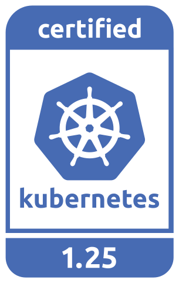
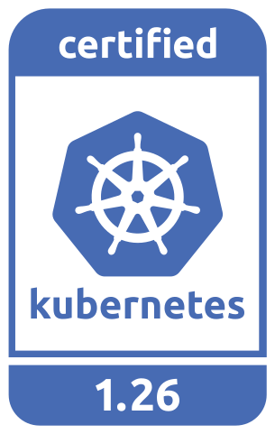
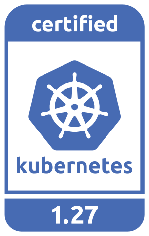

## Amazon EKS Anywhere

**Build status:** 

**Conformance test status:** 

Amazon EKS Anywhere is a new deployment option for Amazon EKS that enables you to easily create and operate Kubernetes clusters on-premises with your own virtual machines or bare metal hosts.
It brings a consistent AWS management experience to your data center, building on the strengths of [Amazon EKS Distro](https://github.com/aws/eks-distro), the same distribution of Kubernetes that powers EKS on AWS.
Its goal is to include full lifecycle management of multiple Kubernetes clusters that are capable of operating completely independently of any AWS services.

Here are the steps for [getting started](https://anywhere.eks.amazonaws.com/docs/getting-started/) with EKS Anywhere.
Full documentation for releases can be found on [https://anywhere.eks.amazonaws.com](https://anywhere.eks.amazonaws.com/).

<!-- 
Source: https://github.com/cncf/artwork/tree/master/projects/kubernetes/certified-kubernetes
-->

## Development

The EKS Anywhere is tested using
[Prow](https://github.com/kubernetes/test-infra/tree/master/prow), the Kubernetes CI system.
EKS operates an installation of Prow, which is visible at [https://prow.eks.amazonaws.com/](https://prow.eks.amazonaws.com/).
Please read our [CONTRIBUTING](CONTRIBUTING.md) guide before making a pull request.
Refer to our [end to end guide](https://github.com/aws/eks-anywhere/tree/main/test/e2e) to run E2E tests locally.

The dependencies which make up EKS Anywhere are defined and built via the [build-tooling](https://github.com/aws/eks-anywhere-build-tooling) repo.
To update dependencies please review the Readme for the specific dependency before opening a PR.

See [Cherry picking](./docs/developer/cherry-picks.md) for backporting to release branches

## Security

If you discover a potential security issue in this project, or think you may
have discovered a security issue, we ask that you notify AWS Security via our
[vulnerability reporting page](http://aws.amazon.com/security/vulnerability-reporting/).
Please do **not** create a public GitHub issue.

## License

This project is licensed under the [Apache-2.0 License](LICENSE).
