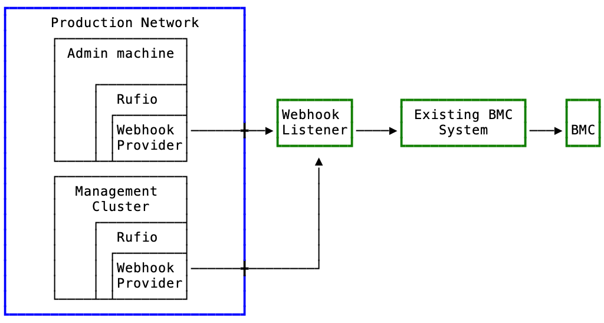
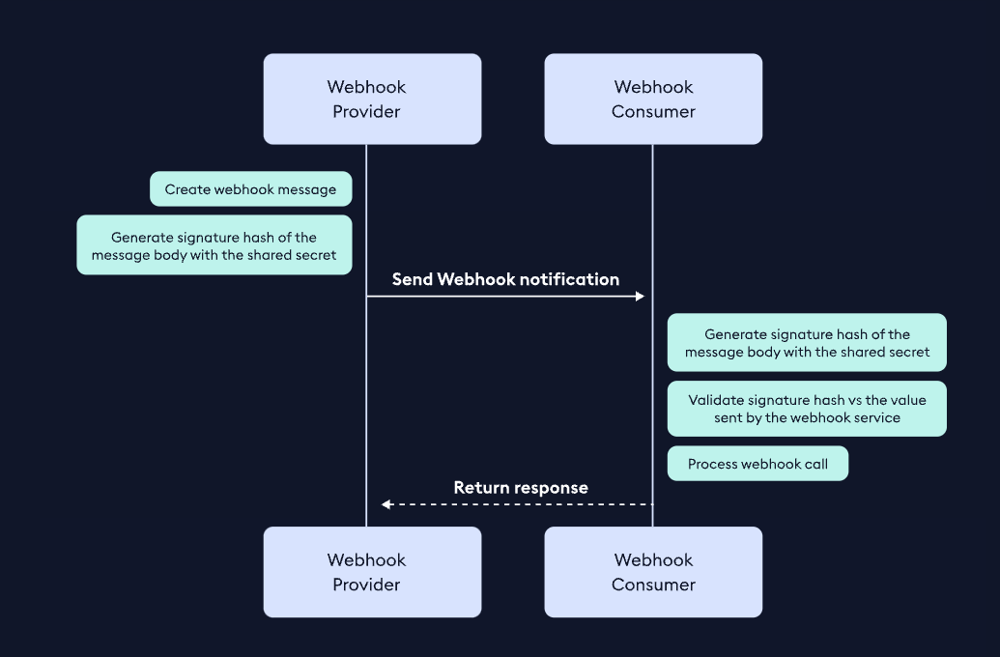
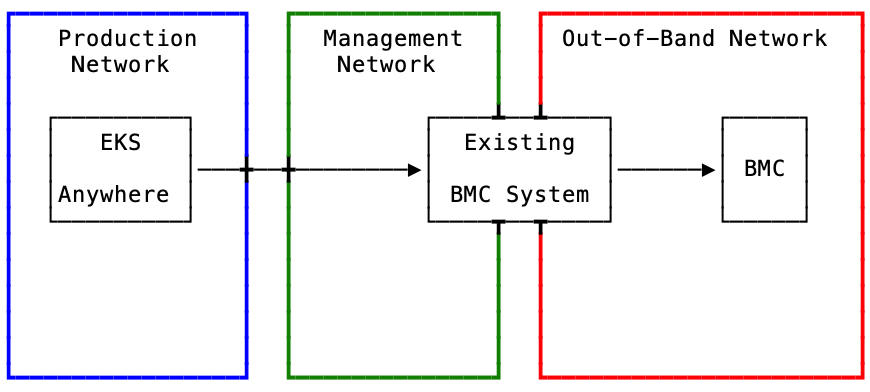
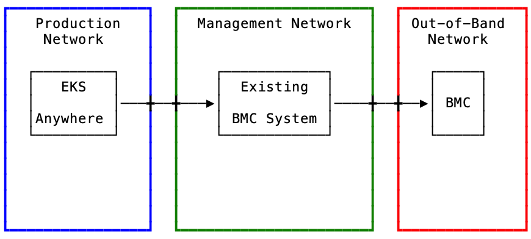
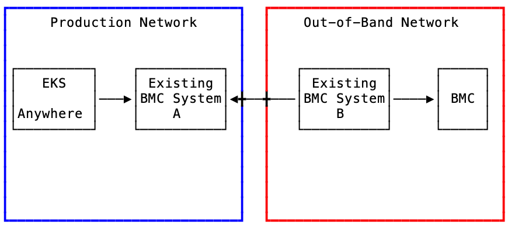

# BMC interactions in EKS Anywhere - bare metal

## What is the problem

### Segregated Networks

Currently, EKS Anywhere - bare metal deploys the Tinkerbell stack. In the Tinkerbell stack, [Rufio](https://github.com/tinkerbell/rufio) is deployed for [out-of-band](https://en.wikipedia.org/wiki/Out-of-band_management) interactions. In order for Rufio to interact with a machine’s [BMC](https://www.onlogic.com/company/io-hub/baseboard-management-controller/), the network where EKS Anywhere is deployed must have network connectivity to the machine’s BMC. This means that if you deploy EKS Anywhere into your production network, then your BMC network must be routable/reachable from the production network. This could mean that both the machines and their BMCs are in the same network.

For most enterprise networks, this network connectivity between a production environment and a BMC network does not exist. This has been my experience. Chris Short [asked folks on Twitter](https://twitter.com/ChrisShort/status/1514257848921899012), “Are your BMC, iDrac, and iLoM devices connected to the same network your servers are?”. The responses were basically, no network connectivity between the two. We have received this same feedback from some customers. They are requesting a solution in EKS Anywhere to handle machine control in environments with separate production and out-of-band networks.

### Interoperability with existing systems

The second problem is that some customers have existing systems that handle BMC interactions. These systems are the only ones permitted to interact with/perform BMC interactions. EKS Anywhere has no way to interoperate with existing systems that do not look and act like a BMC. With BMC interactions being [optional](https://anywhere.eks.amazonaws.com/docs/reference/baremetal/bare-preparation/), a customer could decide not to enable them. This leaves the responsibility on the customer to provide power and next boot BMC calls. At low scale this can be accomplished manually. At higher scale and if there are automation requirements this makes it very difficult.  It requires much code knowledge for customers to “hook” into our `cluster create` and `cluster upgrade` code workflows in order to handle BMC interactions. Without this ability customers are relegated to manual option. While this might be acceptable for a management cluster deployment, we have found that most customers creating workload clusters need this functionality and often the people provisioning workload cluster don’t have the proper access to interact with the BMCs.

>**For the context of this document, machine control is defined as being able to power a machine on or off and to be able to set a one time next boot device (“pxe”).**

## Introduction

This doc will outline a proposed solution to enable machine control with EKS Anywhere - bare metal in environments where the EKS Anywhere deployment and the out-of-band network are not connected/routable and/or where interoperability with an existing BMC System is required. While this solution is currently being driven by feedback from customer use cases, we will be creating a generic solution that will satisfy most customer use-cases. It is not sustainable from an engineering standpoint to build bespoke integrations per customer and as an open source project this could potentially expose customer identifiable information. The solution will be generic enough for most customers and will be developed in the appropriate upstream repos.

For context on where BMC calls are made: EKS Anywhere deploys the Tinkerbell stack. The Tinkerbell stack contains the Rufio service. Rufio is responsible for all BMC interactions. Rufio has a concept of providers. A provider is a single way in which to interact with a BMC. For example, Rufio has a provider that implements calls to the BMC via [Redfish](https://en.wikipedia.org/wiki/Redfish_(specification)).

Finally, it is important to note that this functionality will only be available in the bare metal provider.

### Tenets

* Flexible in its configurability
* Generic enough to meet most customers needs and environments.
* Upstream first. The solution will be developed in the appropiate upstream repos and then consumed by EKS Anywhere.

### Goals and objectives

* Enable interactions with BMCs that are in segregated networks from both the EKS Anywhere admin machine and management cluster.
* Provide a mechanism that enables interoperability with existing BMC systems.

### Statement of scope

Rufio handles all BMC interactions. In [eksctl-anywhere](https://github.com/aws/eks-anywhere), we handle accepting credentials per BMC so that we can create secrets that Rufio CRDs consume ([`auth`Secret`Ref`](https://doc.crds.dev/github.com/tinkerbell/rufio/bmc.tinkerbell.org/Machine/v1alpha1@v0.3.0)). This means that the scope of work should mostly be contained to the Rufio code base and to a lesser amount of scope in the [eks-anywhere](https://github.com/aws/eks-anywhere) repo. We will endeavor to not implement any significant changes to the existing way in which we accept credentials, i.e. in the [`hardware.csv`](https://anywhere.eks.amazonaws.com/docs/reference/baremetal/bare-preparation/) file.

The proposed solution will focus on solving the “Interoperability with existing systems” problem as most (if not all) customers with an existing system will have already handled the “Segregated Networks” problem.

## Overview of solution

The solution will be two-fold. First, we will build into Rufio the ability to send a [webhook](https://webhooks.fyi/docs/webhook-primer) notification.  Second, the customer must provide and/or create a webhook listener to receive the webhook notifications.

Webhook terminology.

1. **Provider**: This is the system that creates the HTTP request and sends it to a consumer. A Provider is also known as a sender.
2. **Consumer**: This is the system that receives a webhook notification. A Consumer is also known as a receiver or listener.
3. **Notification**: This is HTTP(S) request made from the Provider to the Consumer. talk about the expectation for a bmc action to occur.
4. **Signature Payload**: This is the concatenation of the request body and chosen headers. This is what get signed and passed along to the webhook consumer. It allows for authentication of the notification.

Inside of Rufio all BMC interactions are handled using the [bmclib](https://github.com/bmc-toolbox/bmclib) library. This webhook provider will be created in Rufio as a bmclib provider (see here for more on [bmclib](https://github.com/bmc-toolbox/bmclib/) [providers](https://github.com/bmc-toolbox/bmclib/tree/main/providers)). Customers will provide EKS Anywhere the full URL for their webhook listener, for example: `https://mycompany/webhooks`. Customers will also be able to configure the following options for sending the webhook notification.

* HTTPS
  * with user specified certificate
  * unsigned or signed payload ([HMAC](https://www.okta.com/identity-101/hmac/))
  * timestamp header
* HTTP (ideally should only be used for development proposes)
  * unsigned or signed payload (HMAC)
  * timestamp header

Signing the signature payload using HMAC is one of [the most common](https://webhooks.fyi/security/hmac) ways in which to secure webhooks. Industry examples include GitHub, Shopify, Slack, Square, and Twilio. The popularity of HMAC in the industry, its low complexity to implement and consume, and its strong security posture (keys are not sent in the webhook notification) are the main reasons it was selected.

### Architectural or component-level design

There are too many options to document for what a customer network might look like and how an existing BMC system integrates into said network. With that said, I will offer 3 “reference” networks+BMC systems so that there is a clear understanding for potential setups. This will also give us environments to use when discussing and brainstorm ideas and scenarios. See [Appendix I](https://quip-amazon.com/nGFDAV4bblUU/BMC-interactions-in-EKS-Anywhere-bare-metal#temp:C:YCV11fd905c115e4c48b5f9e0f7c) for the reference networks.

In all reference networks, the Production and the Out-of-Band networks cannot communicate with each other and EKS Anywhere (admin machine and management cluster) is deployed into the Production Network. See the Appendix for the details.

>**One thing to note is that this solution will not support environments where the communication between the Rufio webhook provider and the customers webhook listener require going through an HTTP(S) proxy. Generally, a proxy like this is used for outbound internet destined traffic. We have not received any feedback from customers that this is a requirement.**

#### Webhook Provider Architecture

Regardless of the customer reference, Rufio (with the new webhook provider) will send a webhook notification to the customers existing BMC System.



image taken from: <https://webhooks.fyi/security/hmac>

### Dependencies and consumers

### Design details

#### Where the code will live

We will start by writing the webhook provider in the Rufio code base. We may end up moving it in the the bmclib code base. Approvals for updating Rufio will be a bit quicker than with bmclib. We will start the process to get this into bmclib but it won’t affect the delivery of the solution.

#### Implementation Details

Once the provider is written, it be be constructed and registered with the other existing bmclib providers. See [here](https://github.com/tinkerbell/rufio/blob/a6b208f19c9ee97fb9d9211cfdd26b971eac90ae/controllers/client.go#L17).

```Go
wh := &webhook.New()
client.Registry.Register(wh.Name, wh.ProviderProtocol, wh.Features, nil, wh)
```

Bmclib providers are written to satisfy a few different interfaces depending on the functionality they will support. For Rufio/EKS Anywhere, we’ll want to implement the following interfaces. This enables the features that [CAPT](https://github.com/tinkerbell/cluster-api-provider-tinkerbell) requires (power on, power off, next boot device)

* [Opener](https://github.com/bmc-toolbox/bmclib/blob/2714c7479477a369f68bc3c67449dde393167711/bmc/connection.go#L14)
* [Closer](https://github.com/bmc-toolbox/bmclib/blob/2714c7479477a369f68bc3c67449dde393167711/bmc/connection.go#L19)
* [PowerSetter](https://github.com/bmc-toolbox/bmclib/blob/2714c7479477a369f68bc3c67449dde393167711/bmc/power.go#L13)
* [PowerStateGetter](https://github.com/bmc-toolbox/bmclib/blob/2714c7479477a369f68bc3c67449dde393167711/bmc/power.go#L29)
* [BootDeviceSetter](https://github.com/bmc-toolbox/bmclib/blob/2714c7479477a369f68bc3c67449dde393167711/bmc/boot_device.go#L13)

Rufio currently requires a secret for [each machine](https://github.com/tinkerbell/rufio/blob/54081cd4ecad76e7a6643ec804982ff279bad0e1/controllers/task.go#L93). The webhook provider will use the same secret(s) for HMAC signing for all machines. Right now, we create all secrets via EKS Anywhere CLI. This pattern will not change. We will be updating the EKS Anywhere code base to use the same secret(s) for all machines.

#### Payload

The core of the webhook provider will be constructing an HTTP request to send to the customer defined URL. The webhook provider will send notifications to a single endpoint that must accept the same payload spec for all BMC request (power on, power off, etc). Webhook consumers will be required to parse the payload to determine which BMC action is being requested.

Payload example with all fields (in operation, EKS Anywhere will only send single task requests).

```json
{
  "host": "192.168.2.3",
  "task": {
    "power": "on",
    "bootDevice": {
      "device": "pxe",
      "persistent": true,
      "efiBoot": true
    },
    "virtualMedia": {
      "mediaUrl": "https://boot.netboot.xyz/ipxe/netboot.xyz.iso",
      "kind": "CD"
    }
  }
}
```

Example payload for setting the next boot device to “pxe”.

```json
{
   "host": "192.168.2.2",
   "task": {
        "bootDevice": {
            "device": "pxe",
            "persistent": false,
            "efiBoot": false
        }
   }
}
```

#### OpenAPI v3 Spec

The following OpenAPI v3 spec is an example of what we will provide customers to aid in any development of a webhook consumer they might do. This is just an example. This spec can be put into an [online openapi editor](https://editor.swagger.io/) for manipulation and for generating  clients and servers. It is important to say again that EKS Anywhere will not be implementing any server functionality. Only client functionality.

```yaml
openapi: 3.0.3
info:
  title: Webhook Receiver - OpenAPI 3.0
  description: |-
    Webhook notification spec
  version: "0.1"
servers:
  - url: https://localhost:9000
tags:
  - name: BMC
    description: Webhook listener notification for BMC interactions
paths:
  /webhook: # This URI is just an example as it is completely defined by the customer
    post:
      tags:
        - BMC
      summary: webhook listener for BMC calls
      description: All BMC actions should be handle here. The payload will be different
      requestBody:
        description: Webhook for all BMC calls
        content:
          application/json:
            schema:
              $ref: '#/components/schemas/BMC'
        required: true
      responses:
        '200':
          description: Successful operation
components:
  schemas:
    BMC:
      type: object
      properties:
        host:
          type: string
          example: "192.168.2.3"
          description: The IP or hostname of a BMC
        task:
          type: object
          description: The BMC task that is being requested
          properties:
            power:
              type: string
              example: on
              enum:
                - on
                - off
                - cycle
            bootDevice:
              type: object
              properties:
                device:
                  type: string
                  enum:
                    - "pxe"
                    - "disk"
                persistent:
                  type: boolean
                efiBoot:
                  type: boolean
            virtualMedia:
              type: object
              properties:
                mediaUrl:
                  type: string
                  example: "https://boot.netboot.xyz/ipxe/netboot.xyz.iso"
                kind:
                  type: string
                  enum:
                    - "CD"
```

#### API Model

It warrants an explanation for the API model that we’re using. In the industry, Webhooks typically fall somewhere outside of Restful and RPC based. Our implementation follows suite. We’re using neither a [Restful API](https://aws.amazon.com/what-is/restful-api/) nor an [RPC based API](https://apisyouwonthate.com/blog/understanding-rpc-rest-and-graphql/#:~:text=RPC%20is%20the%20earliest%2C%20simplest,can%20become%20a%20Web%20API.). The strongest reason for this is that we will not be implementing the server side of this API, the customer will. And as the customer can define any URL, URI, or endpoint for which we will send a webhook notification, this means that the headers and body of the request are the only parts that are really within our scope to define. Also, having just a single endpoint (as opposed to Restful/RPC endpoints for power, next boot device, etc) is a simpler and arguably more flexible configuration experience for the both EKS Anywhere and the customer. The trade-off we take on here is that the webhook listener must parse a single spec in order to determine the BMC interaction to take. There exists a possibility that a webhook notification could define more than one task. Which one should be acted upon first? The mitigation for this challenge isthat we will ensure the webhook provider in Rufio only ever defines a single task in its HTTP body.

#### Signature Payload

>***The signature payload is the concatenation of the request body and chosen headers. This is what get signed and passed along to the webhook consumer. It allows for authentication of the notification.***

To create the signature payload we will use the following process. This is a high level walk through, we will provide very details steps during the implementation phase.

1. Create the timestamp header using RFC3339: '`X-Rufio-Timestamp: 2006-01-02T15:04:05Z07:00`'
2. Create a string by concatenating the HTTP request body and the timestamp header. There should not be any characters/delimiters in between concatenated strings.
3. HMAC sign (SHA256/SHA512) this string using the provided secret.
4. Hex encoded the HMAC signature (depending on the tool/language you use to HMAC sign this step could be redundant).
5. Prepend the algorithm type and an equal sign to the hex encoded HMAC signature (`sha256=`).
6. Store the signature in the signature header: '`X-Rufio-Signature: sha256=3ac3355...c9846`'

Examples:

```Go
// Go example
import (
    "crypto/hmac"
    "crypto/sha256"
    "encoding/hex"
    "fmt" 
)

// 1. concatenate the body and the timestamp header
body := `{"host":"192.168.2.3","task":{"bootDevice":{"device":"pxe","persistent":false,"efiBoot":false}}}`
signPayload := fmt.Sprintf("%s%s", body, req.Header.Get("X-Rufio-Timestamp"))

// 2. HMAC sign
secret := "superSecret"
h := hmac.New(sha256.New, []byte(secret))
if _, err := h.Write(signPayload); err != nil {
    return nil, err
}

// 3. Make a hex encoded string of the HMAC signature 
sig := hex.EncodeToString(hsh.Sum(nil))

// 4. Prepend the algorithm type to the signature
sig = fmt.Sprintf("sha256=%s", sig)

// 5. Store the string signature in the header
req.Header.Add("X-Rufio-Signature", sig)

```

```Python
# Python example
import datetime
import hmac
import hashlib
import json

# 1. concatenate the body and the timestamp header
body = json.loads('{"host":"192.168.2.3","task":{"bootDevice":{"device":"pxe","persistent":false,"efiBoot":false}}}')
headers = {"X-Rufio-Timestamp": datetime.datetime.now(datetime.timezone.utc).isoformat(), "Content-Type": "application/json"}
signPayload = '{}{}'.format(json.dumps(req.json), req.headers.get('X-Rufio-Timestamp')).encode('utf-8')

# 2. HMAC sign
secret = bytes('superSecret1' , 'utf-8')
signature = hmac.new(secret, signPayload, hashlib.sha256)

# 3. Make a hex encoded string of the HMAC signature
sig = signature.hexdigest()

# 4. Prepend the algorithm type to the signature
sig = 'sha256=' + sig

# 5. Store the string signature in the header
headers["X-Rufio-Signature-256"] = sig
```

#### Full HTTP Request Example

Will we always use `application/json` as the content type. HTTP method will always be `POST`

```text
POST /webhook
Host: www.example.com
Content-Type: application/json
Timestamp: 2023-06-09T10:26:10-06:00
X-Rufio-Signature: 2dce505d96a53c5768052ee90f3df2055657518dad489160df9913f66042e160
{
    "host": "192.168.2.2",
    "task": {
        "bootDevice": {
            "device": "pxe",
            "persistent": false,
            "efiBoot": false
        }
    }
}
```

#### EKS Anywhere integration

Up to this point in the doc all the development has been in the Rufio code base. Once all that code is complete and merged, in EKS Anywhere we will update the `[GIT_TAG](https://github.com/aws/eks-anywhere-build-tooling/blob/main/projects/tinkerbell/rufio/GIT_TAG)`  in the [build-tooling](https://github.com/aws/eks-anywhere-build-tooling/) repo for Rufio. We will also need to handle the new environment variables that need to be passed to Rufio in the [Tinkerbell Helm chart](https://github.com/aws/eks-anywhere-build-tooling/tree/main/projects/tinkerbell/tinkerbell-chart).

* `webhook_provider_secrets`
* `webhook_consumer_url`
* `webhook_consumer_tls_cert`

Currently BMC credentials are stored in a csv file and are per machine. The paradigm for the webhook provider is a bit different. There will not be a user/password combo per machine, instead all machines will use the secret(s) provided in `webhook_provider_secrets`.

The webhook provider will require at a minimum 2 things from the customer.

1. One or more HMAC secrets for use in signing the payload (HMAC).
    1. These secrets must be provided as a comma separated environment variable. `webhook_provider_secrets="secretOne,secretTwo,secretThree,etc"`
    2. A minimum complexity and length for each HMAC secret will be required and validated.
2. A URL for where we will post webhook notifications.
    1. This URL must be provided as an environment variable. `webhook_consumer_url=https://mywebhookconsumer/webhooks"`
    2. We will do a preflight validation check for connectivity to this URL.

Optionally, a customer can specify a TLS cert to use with all webhook notifications to the `webhook_consumer_url`. This cert must be provided as an environment variable for the CLI to consume. It can be either a file location or the actual cert itself. This cert will be stored as a Kubernetes secret and consumed by Rufio as an environment variable. We will implement a minimum amount of validation of this certificate.

Example environment variable options.

```bash
# file location
webhook_consumer_tls_cert=/my/cert/loc/pub.cer

# certificate itself
webhook_consumer_tls_cert='-----BEGIN CERTIFICATE-----
MIIDhDCCAmygAwIBAgIUUfr1t3W8Tc/4ieVqmKVWcS0ObEcwDQYJKoZIhvcNAQEL
BQAwVTELMAkGA1UEBhMCVVMxCzAJBgNVBAgTAmNhMRQwEgYDVQQHEwtsb3MgYW5n
ZWxlczEUMBIGA1UEChMLZXhhbXBsZS5jb20xDTALBgNVBAMTBHRlc3QwHhcNMjMw
NTI0MjM0NzM1WhcNMzMwNTI0MjM0NzM1WjBVMQswCQYDVQQGEwJVUzELMAkGA1UE
CBMCY2ExFDASBgNVBAcTC2xvcyBhbmdlbGVzMRQwEgYDVQQKEwtleGFtcGxlLmNv
bTENMAsGA1UEAxMEdGVzdDCCASIwDQYJKoZIhvcNAQEBBQADggEPADCCAQoCggEB
AKcVONN3K/vbx67hOJ7BydtCa3opLCd2ommB79Drt9BlzIrwgCAV2aEDLo3bEP0d
hqebRchrMUGV3qZEryhaepMttvolWqRsuui30NamzbQ5zj1y0n9ckzO1epkktcTw
FMVU8xozc+Co61c/u2bRU7xQ8AmGxVtu1m8n/bgZCdieX1nynr9JGWuRsjmUSoWx
sx3nHxrQl6ovOP/CbYWHWyfoG3kQ4nKJOSfozqWQiYaNuSmcBawPGVhKVQMkhJ5E
eJO/KmgLkn/nySMxo7qG8VKoSkUOdmOU0YQdTH65jxNv+vrH3Bt25/iMryJEoGh7
oKGZL1z0v938LjFmvXNHXCMCAwEAAaNMMEowCQYDVR0TBAIwADARBglghkgBhvhC
AQEEBAMCBPAwCwYDVR0PBAQDAgWgMB0GA1UdJQQWMBQGCCsGAQUFBwMCBggrBgEF
BQcDATANBgkqhkiG9w0BAQsFAAOCAQEAbD4lwqF3DU+HxbXPdeG0StCfqSHP3C70
NagpJKd1qJuEOQOkNvFlf/CcFePGXdkwfcAvAB6x+sTHCxo/ajcwzutG9BVHfFGK
nOeHXeWZLCVJpydr37o2MqSsll7aoJ1JlQW1m4793nt4Dgrh6xOO4YhgzQb2ey9S
f4O5NeY17mmQQpPrs5yFORn6WbS+hxNUek4cJlSBd/aOHXBnDolOJFz6961uNYpO
voEQ5v2i/rqwHFT12USCvcIjlJfwyPP6g1m06eHdaiz7verXjosuMUdxiodFZSN9
kUbQYbTrEG/v68bEl4WNdxQjlOlMx5Tzh7i/MUiOjpYekDg0HZhYUA==
-----END CERTIFICATE-----'
```

We will also update the EKS Anywhere CLI to handle the creation of Kubernetes secrets for Rufio. For this we will update EKS Anywhere to use the secret for all machines. This way secrets get handled in the same manner as when not using the webhook provider.

>Important to note that the Cluster spec is not being updated to handling taking in provider secrets, consumer url, or TLS cert because they are not cluster specific configurations. They are internal component configurations.

## Major considerations

### Customer Experience

One of the most important things to point out here is that customer will be required to run a webhook consumer that can receive the webhook notifications and translate them to calls to their existing BMC systems. There are many existing solutions for running a webhook consumer but translating the call to their existing BMC system will be a required lift for the customer.

Another change to the customer experience is that currently, the customer provides credentials (user/pass) in the hardware csv file. When the customer wants to use the webhook provider they will not need to put creds in the hardware csv file but use the environment variable `webhook_provider_secrets`. These secrets will be used for all hardware in the csv. This environment variable will be required during the `create` and `upgrade(scale)`phases of EKS Anywhere management and workload clusters.

#### Webhook Consumer

 The webhook consumer will be expected to handle the following on in the listener. We will provide a reference guide for what we are doing in our testing environment. Please see [Webhook Listener](https://quip-amazon.com/nGFDAV4bblUU#temp:C:YCV647464313f574f9d9519698ad) for more details on that.

* Use of HTTPS on the listener with a strong cipher suite.
* Parsing of the payload spec to determine the appropriate BMC action to perform.
* Message integrity validation and replay prevention validation and enforcement.
* Restrict who can send you webhook requests [based on the IP](https://webhooks.fyi/best-practices/webhook-consumers).
* Storing and rotated secrets.
* Handling notification synchronously.

#### Documentation

We will provide docs that detail the following:

* Complete specs on our webhook security, including the authentication mode, cipher suite, signature procedure, and best practices for security.
* A description of the steps to validate our webhook messages.
* Sample code developers can run to understand how webhook notifications should be processed.
* Instructions on how developers can test our webhooks against their code running on localhost.
* Details for how to trigger, test, and replay webhooks calls with a close feedback loop.

### Security

The webhook provider will have the following configurable security measures available.

* [HMAC SHA-512](https://webhooks.fyi/security/hmac) and SHA-256 signed payloads.
* [Secret rotation](https://webhooks.fyi/ops-experience/key-rotation) via support for multiple payload signatures.
* Timestamp header for [replay prevention](https://webhooks.fyi/security/replay-prevention).
* Version header for [forward compatibility](https://webhooks.fyi/ops-experience/versioning).
* User defined TLS cert.

The default mode of the webhook provider will be to use HMAC SHA-512 for signing and version and timestamp headers.

#### Secret Rotation

“Webhooks rely heavily on secrets — hash keys, tokens, certificates — that should be rotated periodically to keep communications safe.”  - <https://webhooks.fyi/ops-experience/key-rotation>
The webhook provider will allows customers to provider more than one key for signing payloads. Signing webhooks using multiple signatures and then add them all to the signature header (comma separated), will allow consumers to roll out a new secret key and gradually update webhook listeners without outages.

See [II. Webhook Reference Documentation](https://quip-amazon.com/nGFDAV4bblUU#temp:C:YCV4b4974a9f55d4a7998f7e9fc9) for referenced documentation.

### Scaling

Scaling is already built into Kubernetes and the way in which EKS Anywhere deploys Rufio.

### Related work

There is related work to removing BMC credentials from the hardware csv file. This should not block any webhook provider work. <https://github.com/aws/eks-anywhere/issues/5476>  Regardless, we will keep an eye on this.

## Failure modes

### Out of order notification processing

There is a potential that if the customers webhook listener does not handle webhook notification sequentially that netbooting a machine could fail. Rufio sends BMC calls in a specific [order](https://github.com/tinkerbell/cluster-api-provider-tinkerbell/blob/dd49252923b3b44a3bbd8ccc77aaa94ac22f0c34/controllers/machine.go#L610). Power off, set next boot device, power on. Processing the power on first and then a power off, for example, would cause the machine to sit powered off instead of netbooting. This would manifest itself to the customer via a timeout from the EKS Anywhere CLI. It could potentially be very difficult for us to troubleshoot as the issue exists in the customers systems and not ours. We will build in the ability to validate the order in which we send the webhook notifications via log messages. This will allow us to rule out any issues on our end with regard to ordering. Also, we will document the webhook consumer we use in testing (see [Testing](https://quip-amazon.com/nGFDAV4bblUU#temp:C:YCV8f14f165a80047f3b404c3c54) for details) that handles ordering so that customers have a reference option.

### Transient network issues

Transient network issues can cause webhook notifications to fail, get lost, time out, etc. We will build in retries with exponential back off functionality to help mitigate some of these issues. There are [additional ways](https://webhooks.fyi/ops-experience/resiliency) to improve resiliency but they add complexity. We will start with retries and iterate when we receive customer feedback.

## Testing

In order to test properly, it will require creating an “existing BMC System” in our lab environment. This system will be a webhook receiver that can make BMC calls. We will then need to add e2e tests that specify the webhook provider should be used. We will most likely need to setup an environment that does not have access to the BMC network.

### Webhook Listener

<https://github.com/adnanh/webhook> has been identified as a viable candidate for use in e2e testing. It can validate HMAC signatures and call an arbitrary script to make the actual BMC call. This will give us a complete enough solution for testing without having to write and maintain a significant amount of code. This webhook program can process webhook notifications in the order in which they were received thus being able to mitigate the [Failure modes](https://quip-amazon.com/nGFDAV4bblUU#temp:C:YCV30aef1229f3043abae1cc4344) described above. Here is an example config. TODO: describe the general idea for the script that will make the actual BMC call, add HMAC validation.

```yaml
# webhook.yaml
- id: webhook
  execute-command: /tmp/bmc.sh
  command-working-directory: /tmp
  include-command-output-in-response: true
  include-command-output-in-response-on-error: true
  pass-arguments-to-command:
  - source: entire-payload
```

The webhook receiver can be run with

```bash
./webhook -verbose -hooks webhook.yaml -urlprefix ""
```

 The following is an example of sending a webhook (without HMAC) to power a machine on.

```bash
payload='{"host": "192.168.2.5","task": {"power": "on"}}'
curl -v http://localhost:9000/webhook -H 'Content-Type: application/json' -d "$payload"
```

## Observability - monitoring and metrics, logging, tracing

As this is not an entire service there will be constraints on Rufio for much of the observability options.

**Metrics:**
There are currently no plans for adding metrics.

**Logging:**
The webhook provider will log the notifications it sends, any response body that the webhook receiver returns, and the HTTP status code for the response.

**Tracing:**
There are currently no plans for adding tracing.

## Deployment

Deployment is built into EKS Anywhere, no concerns/changes here.

## FAQ

## Alternative designs

### Auth

There are multiple other options for Authentication. Short lived tokens, for example, instead of a HMAC. The challenge of regenerating the short lived token add to the complexity and create an external dependency. This adds complexity to the solution and the testing so it was ruled out.

### Multiple URI endpoints and payloads

We could use a payload per URI (/power, /bootdevice, /virtualmedia). More Restful like. This would require the consumer to implement multiple endpoints. It would also require us to do the same for e2e testing.

### Pub/Sub

Instead of using webhooks, we use Publish/Subscribe model. This is a more robust solution, generally for internal only based notification systems. It is heavier and would require customers to have this existing system available.

### Kubernetes Client

A Kubernetes client is written to watch Rufio specific resources in the cluster and then perform the appropriate actions. This makes sense for folks familiar with Kubernetes and writing clients. This model is a “pull” based approach. This could potentially cause issues around acceptable traffic patterns in a customer network. It is also possible that this is a better option for some customers. This was not chosen for the following reasons:

* Assuming Kubernetes knowledge to accomplish this might not align to the target audience. The folks that would be facilitating this might be more infrastructure/network focused individuals and could be a large barrier to entry.
* The pull model is challenging because they customer would have to first watch the KinD cluster on the admin machine and then move to watching the management cluster.
* The pull model also means a connection must originate from outside the admin node and management cluster and come in. This pattern means the interface the client watches would most likely be what is currently just an implementation detail. This extends our public API and changes the nature of Rufio resource changes.

### SSH

In this solution we would initiate an SSH session to a customer defined host and execute a customer defined script/program. This means the interface is a program and its inputs and outputs. SSH in customer environments will bring very specific enterprise requirements for SSH per customers. There is also a concern around handling concurrency. SSH allows multiple session concurrently. The provider in Rufio will not be able to be aware of other connections. This is a design constraint of bmclib. This means that a customer would have handle this. This is not trivial via SSH.

### Customer implements a Redfish endpoint

This solution would mean no changes to EKS Anywhere would be needed. We would require the customer to implement a Redfish compliant endpoint and provide that in the hardware.csv for all machines. When the customer’s Redfish endpoint receives the HTTP request they would make any necessary transformations and call their existing BMC system. This was not chose as there aren’t any known solutions available for customers to run or even start with to accomplish this. The customer would be on the hook for developing this from scratch. This was not the chosen for this reason.

## Appendices - I, II

### I. Customer Reference Architectures

#### Customer Reference Architecture 1

This customer’s existing BMC System is a machine that has 2 network interfaces. One in each of the Out-of-Band and Management Networks. EKS Anywhere sends the webhook to the BMC System which then translates the call to a BMC in the Out-of-Band network. The Out-of-Band network does not allow any inbound traffic.


#### Customer Reference Architecture 2

The customer’s existing BMC System consists of a machine that lives only in the Management network. EKS Anywhere sends the webhook to the BMC System which then calls the BMC in the Out-of-Band network. The Out-of-Band network allows inbound traffic but only from the Management network.


#### Customer Reference Architecture 3

The customers’s existing BMC System consists of 2 machines. Machine A handles incoming webhooks from EKS Anywhere.  It lives only in the Production network. Machine B interacts with Machine A to retrieve BMC actions to performs and then does the BMC calls. The Out-of-Band network does not allow any inbound traffic.


### II. Webhook Reference Documentation

The following were among the reference material used to aid in creating the security posture.

* <https://docs.github.com/en/webhooks-and-events/webhooks/securing-your-webhooks>
* <https://snyk.io/blog/creating-secure-webhooks/>
* <https://webhooks.fyi/>
