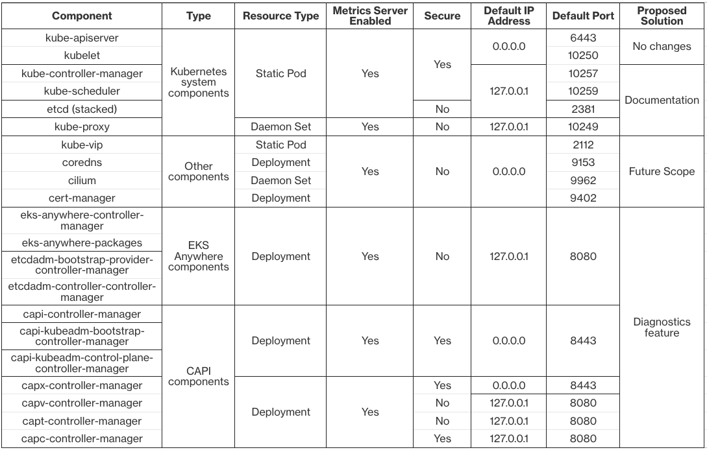

# Expose metrics for all EKS Anywhere components securely

## Problem Statement

Customers want to scrape the metrics of various EKS Anywhere components with Prometheus in order to understand and monitor the state of a cluster. In EKS Anywhere, metrics of only some Kubernetes system components (kube-apiserver, kubelet, coredns, kube-vip, cert-manager, cilium) are exposed by default. Other system components such as `kube-controller-manager` and `kube-scheduler` are configured with the default `--bind-address=127.0.0.1` (localhost). 

Below are some examples of customer requests for exposing metrics:

* https://github.com/aws/eks-anywhere/issues/4299
* https://github.com/aws/eks-anywhere/issues/4405
* https://github.com/aws/eks-anywhere/issues/7106

## Goals and Objectives

As an EKS Anywhere user, I would like to:

* Expose all Kubernetes system component metrics securely with authentication and authorization enabled
* Expose metrics from all EKS Anywhere, CAPI etcd components, and CAPI provider-specific components securely

## Statement of Scope

**In Scope:**

Exposing metrics securely for the following components:

1. Kubernetes system components

* kube-controller-manager
* kube-scheduler
* kube-proxy
* etcd

2. EKS Anywhere components

* eks-anywhere-controller-manager controller
* eks-anywhere-packages controller

3. CAPI etcd components

* etcdadm-bootstrap-provider controller
* etcdadm-controller-controller-manager controller

4. CAPI provider-specific components

* capt-controller-manager controller
* capc-controller-manager controller
* capv-controller-manager controller
* capx-controller-manager controller

**Out of Scope:**

Following components are not considered for exposing metrics securely:

* Snow provider (capas) and Docker provider (capd)
* ECR-credential-provider

**Future Scope:**

* Securely expose metrics for all other components (kube-vip, coredns, cilium, and cert-manager)

## Current State of EKS Anywhere components



## Overview of Solution

There are two general solutions proposed for different components here:

* For Kubernetes system components, documenting the steps to configure some proxy as a daemonset. No code changes needed in EKS Anywhere
* For all other controller-runtime based CAPI and EKS Anywhere components, implementing the CAPI [diagnostics](https://main.cluster-api.sigs.k8s.io/tasks/diagnostics) feature and exposing the bind address with 0.0.0.0

For Kubernetes system components, we don't just want to change the default bind address to 0.0.0.0 because configuring it to bind on all interfaces might expose the metrics publicly over the internet on a node which has any interface exposed to the internet even if that component has authentication and authorization enabled. (Check this [issue](https://github.com/kubernetes/kubeadm/issues/2244#issuecomment-763294722) for more details). Also, it goes against the principle of security [hardening](https://en.wikipedia.org/wiki/Hardening_(computing)) where the default configuration should be kept minimal to reduce the attack surface of the system. For all other controller-runtime based components, it is best to implement the diagnostics feature that CAPI has introduced to match the core controllers and also have consistency across all these components. It also removes the current dependency we have on the [kube-rbac-proxy](https://github.com/brancz/kube-rbac-proxy) for capc controller. Overall, there will be no API changes in the cluster spec for any of the components.

#### **Kube-Apiserver and Kubelet:**

These components already perform bearer token authentication and RBAC authorization for client requests and they are already configured to allow listening on all interfaces and IP address families. No further action needs to be taken to expose metrics for these components securely.

#### **Kube-Controller-Manager, Kube-Scheduler and Kube-Proxy:**

Kube-controller-manager and kube-scheduler already perform bearer token authentication and RBAC authorization whereas kube-proxy does not but all three components listen only on the localhost (127.0.0.1) for client requests. We can document the steps to be followed to configure some proxy as a Daemonset on the cluster which forwards the client requests to the metrics endpoint for each component. The proxy pods must run in the `hostNetwork` so that they can access the loopback interfaces of the corresponding pods. There will be no changes done in EKS Anywhere to configure these for the customers.

**Documentation Steps:**

1. Create a cluster role object which gives permissions to get the metrics

```yaml
apiVersion: rbac.authorization.k8s.io/v1
kind: ClusterRole
metadata:
  name: metrics-reader
rules:
  - nonResourceURLs:
      - "/metrics"
    verbs:
      - get
```

2. Create a cluster role binding object which binds the above cluster role to the service account of the monitoring pod

```yaml
apiVersion: rbac.authorization.k8s.io/v1
kind: ClusterRoleBinding
metadata:
  name: metrics-reader-binding
subjects:
- kind: ServiceAccount
  name: prometheus-server
  namespace: observability
roleRef:
  kind: ClusterRole
  name: metrics-reader
  apiGroup: rbac.authorization.k8s.io
```

3. Create a config map object which stores the proxy configuration to route the request to the components

**HAProxy configuration example:**

```yaml
apiVersion: v1
kind: ConfigMap
metadata:
  name: metrics-proxy
data:
  haproxy.cfg: |
    defaults
      mode http
      timeout connect 5000ms
      timeout client 5000ms
      timeout server 5000ms
      default-server maxconn 10

    frontend kube-proxy
      bind ${NODE_IP}:10249
      http-request deny if !{ path /metrics }
      default_backend kube-proxy
    backend kube-proxy
      server kube-proxy 127.0.0.1:10249 check

    frontend kube-controller-manager
      bind ${NODE_IP}:10257
      http-request deny if !{ path /metrics }
      default_backend kube-controller-manager
    backend kube-controller-manager
      server kube-controller-manager 127.0.0.1:10257 ssl verify none check

    frontend kube-scheduler
      bind ${NODE_IP}:10259
      http-request deny if !{ path /metrics }
      default_backend kube-scheduler
    backend kube-scheduler
      server kube-scheduler 127.0.0.1:10259 ssl verify none check

    frontend etcd
      bind \${NODE_IP}:2381
      http-request deny if !{ path /metrics }
      default_backend etcd
    backend etcd
      server etcd 127.0.0.1:2381 check
```

4. Create a Daemonset object to deploy the proxy so that metrics are exposed on all the nodes

**HAProxy daemonset example:**

```yaml
apiVersion: apps/v1
kind: DaemonSet
metadata:
  name: metrics-proxy
spec:
  selector:
    matchLabels:
      app: metrics-proxy
  template:
    metadata:
      labels:
        app: metrics-proxy
    spec:
      tolerations:
      - key: node-role.kubernetes.io/control-plane
        operator: Exists
        effect: NoSchedule
      hostNetwork: true
      containers:
        - name: haproxy
          image: haproxy:2.9
          env:
            - name: NODE_IP
              valueFrom:
                fieldRef:
                  apiVersion: v1
                  fieldPath: status.hostIP
            - name: TOKEN
              value: "$(cat /var/run/secrets/kubernetes.io/serviceaccount/token)"
          ports:
            - name: kube-proxy
              containerPort: 10249
            - name: kube-ctrl-mgr
              containerPort: 10257
            - name: kube-scheduler
              containerPort: 10259
            - name: etcd
              containerPort: 2381
          volumeMounts:
            - mountPath: "/usr/local/etc/haproxy"
              name: haproxy-config
      volumes:
        - configMap:
            name: metrics-proxy
          name: haproxy-config
```

5. Verify that the metrics are exposed to the monitoring pods by running the following command from the container

```bash
export TOKEN=$(cat /var/run/secrets/kubernetes.io/serviceaccount/token)
curl -H "Authorization: Bearer ${TOKEN}" http://{node-IP}:{component-port}/metrics
```

If some customer doesn't need to expose the kube-proxy metrics, then the daemonset can be configured to run the proxy pods on only the control plane nodes using [node labels](https://kubernetes.io/docs/concepts/scheduling-eviction/assign-pod-node/#built-in-node-labels) and [node selector](https://kubernetes.io/docs/concepts/scheduling-eviction/assign-pod-node/#nodeselector) or using [node affinity](https://kubernetes.io/docs/concepts/scheduling-eviction/assign-pod-node/#node-affinity). Since kube-proxy is itself a daemonset that runs on all nodes, exposing its metrics requires running the metrics proxy on all nodes.

This solution is also extensible as the above steps can also be applied to other external or custom components which don't expose metrics endpoint by default. It also avoids any security risk of exposing metrics to the internet associated with configuring the bind-address for kube-controller-manager and kube-scheduler. This is explained below in the alternate solutions section.

Another advantage is that it provides flexibility to the customers in choosing any proxy based on their preference. Some of the most popular proxies include [nginx](https://github.com/nginx-proxy/nginx-proxy), [envoy](https://github.com/envoyproxy/envoy), [haproxy](https://github.com/haproxy/haproxy), [traefik](https://github.com/traefik/traefik), etc. We will document an example config for HAProxy and customers can configure it similarly for other proxies.

One drawback is that it provides a bad User Experience to the customers as they need to configure these additional objects for each of their clusters. But as the number of users which require this feature is not large enough to justify supporting it in EKS Anywhere, this is a good workaround solution to document it to the users. Even kubeadm doesn't support it for the same reason. For more details, check out this [issue](https://github.com/kubernetes/kubeadm/issues/2388#issuecomment-776073834)

A disadvantage is that prometheus associates metrics with pod names but since the pods are behind a proxy, the proxy's pod name will be used instead for the metrics. (see [issue](https://github.com/prometheus-operator/kube-prometheus/issues/718#issuecomment-776360908) for more details)

#### **EKS Anywhere Controller Manager and EKS Anywhere Packages:**

These components do not perform any kind of authentication or authorization for client requests and listen only on the localhost by default. We will implement the diagnostics feature to expose metrics securely on all interfaces.

#### **Etcdadm Bootstrap Provider Controller Manager and Etcdadm Controller Controller Manager:**

These components also do not perform any kind of authentication or authorization for client requests and listen only on the localhost by default. We will implement the diagnostics feature to expose metrics securely on all interfaces.

#### **Capi-Controller-Manager, capi-kubeadm-bootstrap-controller-manager and capi-kubeadm-control-plane-controller-manager:**

These components already implement the diagnostics feature to expose metrics securely on all interfaces. No further action needs to be taken to expose metrics for these components securely.

#### **EKS Anywhere supported CAPI providers (capv, capx, capt, capc):**

For capc, we have kube-rbac-proxy already implemented as a secure way to expose metrics but it listens only on the localhost. We can remove the dependency on kube-rbac-proxy for capc and implement the diagnostics feature. This would enable us to expose metrics securely on all interfaces at diagnostics address `:8443`

For capv, the diagnostics feature has already been implemented in the [latest](https://github.com/kubernetes-sigs/cluster-api-provider-vsphere/releases/tag/v1.9.2) release but our `eks-anywhere-build-tooling` repo points to an [older release](https://github.com/aws/eks-anywhere-build-tooling/blob/main/projects/kubernetes-sigs/cluster-api-provider-vsphere/GIT_TAG) version which does not support the diagnostics feature and defaults to `127.0.0.1` for `--metrics-bind-addr` flag. We would just need to bump the capv version to the latest release version.

For capx, the diagnostics feature has already been implemented and we also point to the latest release in the `eks-anywhere-build-tooling` repo. No further action needs to be taken to securely expose metrics for capx.

For capt, it does not perform any kind of authentication or authorization for client requests and listens only on the localhost by default. We can implement the diagnostics feature to expose metrics securely on all interfaces.

## Implementation Details

**Diagnostics Feature for all EKS Anywhere, CAPI etcd and CAPI provider-specific controllers:**

Diagnostics feature - https://main.cluster-api.sigs.k8s.io/tasks/diagnostics

```
spec:
  containers:
   - command:
      - /manager
    args:
      - --diagnostics-address:=`${CAPI_DIAGNOSTICS_ADDRESS:=:8443}`
      - --insecure-diagnostics:=false
    ports:
      - containerPort: 8443
        name: metrics
        protocol: TCP
    ...
```

Add the above args and metrics port to the controller manager deployment in `config/manager/manager.yaml`

```
rules:
- apiGroups:
  - authentication.k8s.io
  resources:
  - tokenreviews
  verbs:
  - create
- apiGroups:
  - authorization.k8s.io
  resources:
  - subjectaccessreviews
  verbs:
  - create
```

Add above rules to the manager cluster role in `config/rbac/role.yaml`

```
// Add RBAC for the authorized diagnostics endpoint.
// +kubebuilder:rbac:groups=authentication.k8s.io,resources=tokenreviews,verbs=create
// +kubebuilder:rbac:groups=authorization.k8s.io,resources=subjectaccessreviews,verbs=create

func main() {
    flags.AddDiagnosticsOptions(fs, &diagnosticsOptions)
}
```

Add the diagnostics options capi flags and rbac [markers](https://book.kubebuilder.io/reference/markers/rbac) to the controller binary in `main.go` 

## Testing

* E2E tests for the diagnostics feature
* Unit tests for any additional utility functions implemented

## Documentation

* Add necessary steps on configuring the metrics proxy daemonset in the cluster to the EKS Anywhere docs
* We can reference the [CAPI](https://main.cluster-api.sigs.k8s.io/tasks/diagnostics#scraping-metrics) documentation on diagnostics feature for scraping metrics from the controllers

## Alternate Solutions Considered

### Using kube-rbac-proxy for all components

Using kube-rbac-proxy for all EKS Anywhere components to expose metrics securely by enforcing RBAC policies and authentication. In this approach, metrics requests are routed through the kube-rbac-proxy, which sits between the client and the API server. Kube-rbac-proxy authenticates the client using various authentication mechanisms such as bearer token, client TLS certificates, request header authentication, etc. It then verifies the client's RBAC permissions and only allows access to the metrics endpoint if the client has the necessary privileges. For more details, check out option 2 [here](https://quip-amazon.com/II8XAy90Pq2v/Expose-metrics-of-EKS-A-components#temp:C:fRf4452d35522194e5bb535f4d14)

This approach enables authentication and RBAC authorization for all the components but requires maintaining an additional upstream dependency. Some Kubernetes system components already do have authn/authz enabled by default and capi also introduced the diagnostics feature recently which is the preferred way of enabling authn/authz for the controller-runtime based components. So using kube-rbac-proxy as an additional layer of security for these components is not necessary.

Another thing to note is that kube-rbac-proxy project is in alpha stage and may have significant changes in the future. So, it's better to not have a dependency on it in the future if there are better alternatives available.

### Configurable bind-address for kube-scheduler and kube-controller-manager

We can allow customers to configure the `--bind-address`  flag for these components through the cluster spec to allow listening on all interfaces and IP address families so that prometheus or any other component with appropriate RBAC permissions can scrape the metrics endpoint for these components securely.

Currently, we cannot make the `--metrics-bind-address`  flag configurable for kube-proxy through the cluster spec as CAPI doesn't support configuring kube-proxy configuration. In the future, we can either patch CAPI to enable support for configuring kube-proxy or [disable](https://github.com/kubernetes-sigs/cluster-api/issues/4512#issuecomment-1267092583) installing kube-proxy from CAPI and install it in EKS Anywhere instead.

**Schema:**

```yaml
apiVersion: anywhere.eks.amazonaws.com/v1alpha1
kind: Cluster
metadata:
  name: mgmt-cluster
spec:
  ...
  controlPlaneConfiguration:
    ...
    controllerManagerExtraArgs:
      bindAddress: "0.0.0.0"
    schedulerExtraArgs:
      bindAddress: "0.0.0.0"
```

The main concern with making bind-address configurable is that configuring it to bind on all interfaces might expose the metrics publicly over the internet on a node which has any interface exposed to the internet. In a cluster with single control plane node, binding it to the control plane node ip address would solve the issue but it wouldn't work for HA clusters with multiple control plane nodes which is usually the case in a production environment. Another solution would be to apply [firewall rules](https://github.com/kubernetes/kubeadm/issues/2244#issuecomment-763533964) on every node before binding to 0.0.0.0 but this is not a good idea either.

Another thing to note is that it is tough to validate the range of IP addresses that bind address can be allowed to be configure with. Even Kubernetes does not do any such validation for these components. Only validation that can be done is that the address is in a proper IPv4/IPv6 format. If a user configures some unreachable address, it would be hard to debug the issue with the component.

**Implementation:**

```yaml
controllerManagerExtraArgs:
  "bind-address": "0.0.0.0"
schedulerExtraArgs:
  "bind-address": "0.0.0.0"
```

These flags will be fetched from the cluster spec and added to the [controllerManagerExtraArgs](https://kubernetes.io/docs/setup/production-environment/tools/kubeadm/control-plane-flags/#controllermanager-flags) and [schedulerExtraArgs](https://kubernetes.io/docs/setup/production-environment/tools/kubeadm/control-plane-flags/#scheduler-flags) map in the `ClusterConfiguration` object during create and upgrade operations for generating control plane CAPI spec.

**Testing:**

* E2E tests will be required to test whether the flags are actually configured for Kubernetes system components

**Validations:**

* Validate that the `bind-address` flag is in a proper format similar to how Kubernetes does it [here](https://github.com/kubernetes/kubernetes/blob/f4e246bc93ffb68b33ed67c7896c379efa4207e7/pkg/proxy/apis/config/validation/validation.go#L274) for kube-proxy

**Documentation:**

We can add `controlPlaneConfiguration.controllerManagerExtraArgs.bindAddress` and `controlPlaneConfiguration.schedulerExtraArgs.bindAddress` as an optional configuration to our EKS Anywhere docs

## References

* https://kubernetes.io/docs/concepts/cluster-administration/system-metrics/
* https://github.com/kubernetes/kubeadm/issues/1285#issuecomment-459157839
* https://github.com/kubernetes-sigs/controller-runtime/pull/2407

