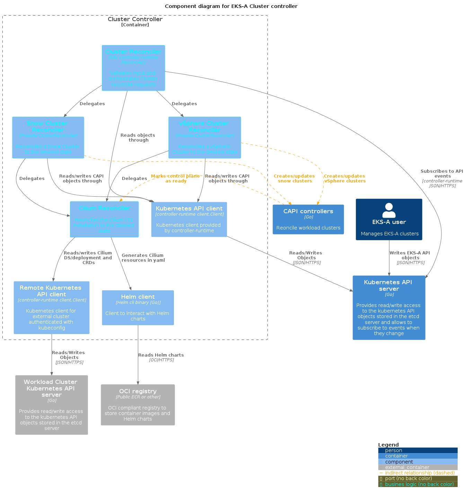
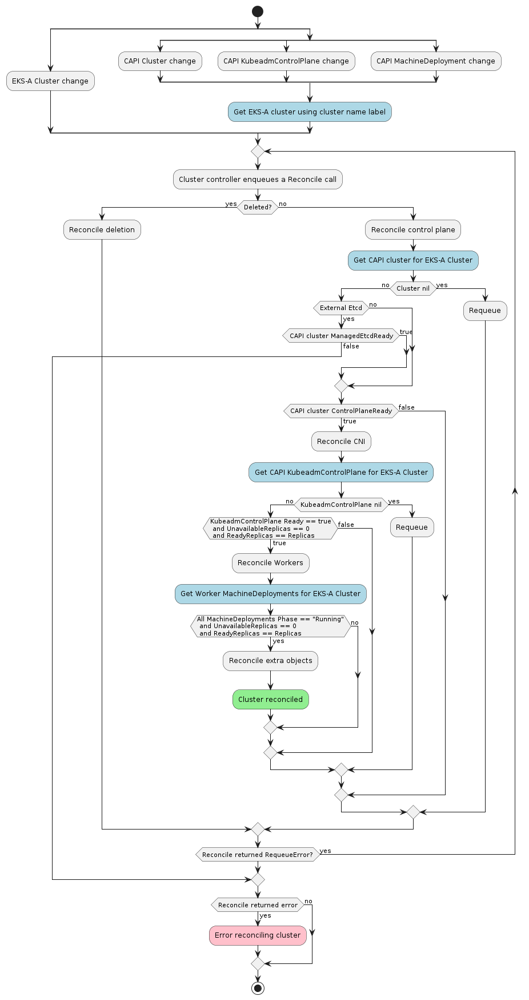
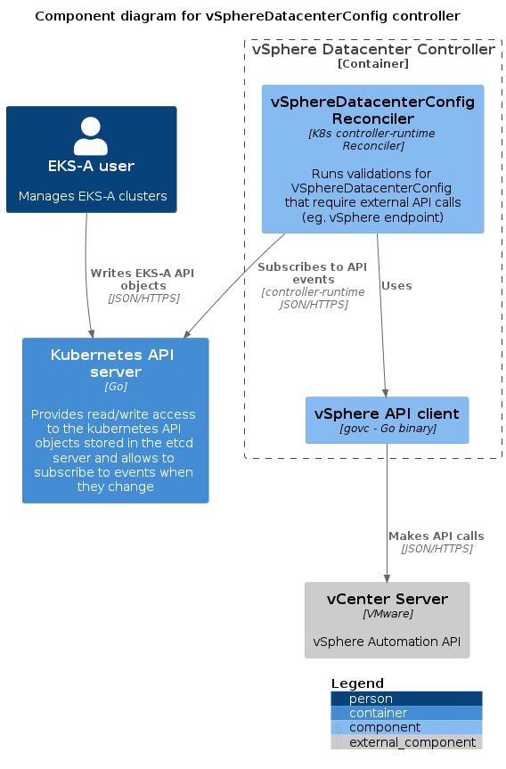
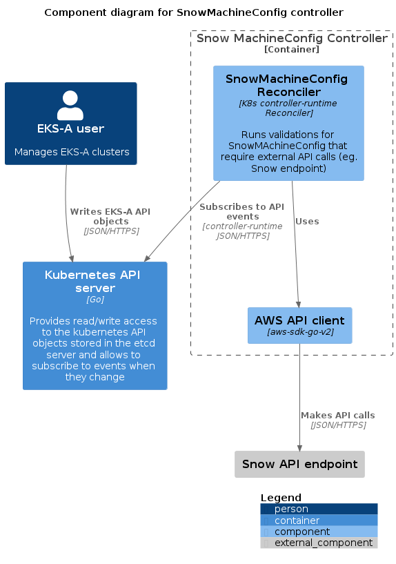
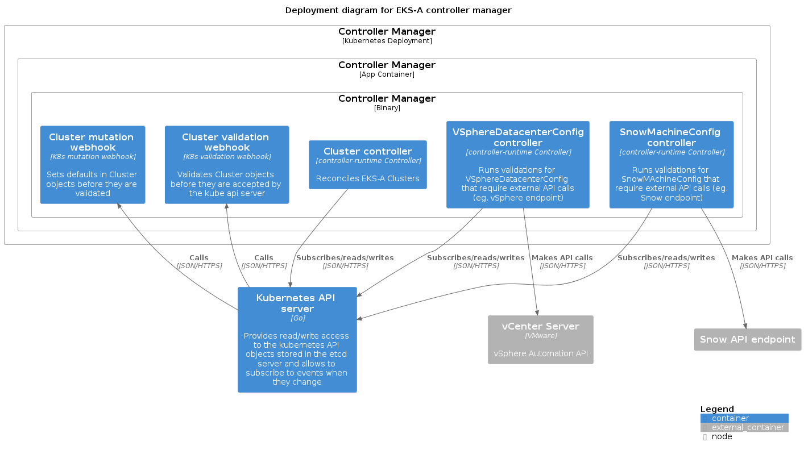

# Full Cluster Lifecycle API

## Introduction

**Problem:** currently, the only way to manage EKS Anywhere clusters is by using the CLI. We lack an API to facilitate automation.

This takes away from the native Kubernetes experience we want users to have, even when managing the cluster lifecycle (for example, being able to use `kubectl`).

Moreover, it stops users from being able to rely on GitOps (one of our core recommendations to manage EKS Anywhere) for full cluster lifecycle.

### Tenets

* ****Simple:**** simple to use, simple to understand, simple to maintain
* ****Declarative:**** intent based system, as close to a Kubernetes native experience as possible

### Goals and Objectives

As a Kubernetes administrator I want to:

* Create EKS Anywhere workload clusters using: kubectl apply -f cluster.spec
* Upgrade EKS Anywhere workload clusters using: kubectl apply -f cluster.spec
* Delete EKS Anywhere workload clusters using: kubectl delete -f cluster.spec
* Create EKS Anywhere workload clusters using GitOps
* Update/Upgrade EKS Anywhere workload clusters using GitOps
* Delete EKS Anywhere workload clusters using GitOps

### Statement of Scope

**In scope**

* Cluster full lifecycle with `kubectl` for workload clusters
* Cluster full lifecycle with GitOps for workload clusters

**Not in scope**

* Create/upgrade/delete self-managed clusters through the API

**Future scope**

* Reconcile (updates) GitOps configuration
* Reconcile (updates) identity providers' configuration
* Shared objects (like machine configs) between a self-managed cluster and managed clusters
* Managed clusters that are also management clusters

## Overview of Solution

The introduction of managed clusters (vs self-managed ones) in release `v0.6.0` opens the possibility of using a management cluster that runs the EKS Anywhere controller, where we can implement the logic to create/upgrade/delete “workload” clusters. Such controller would reconcile the EKS Anywhere CRDs, which would become the API that users can leverage to fully manage clusters. That API is by nature compatible with `kubectl` (or any other Kubernetes client) and Flux (our GitOps chosen tool).

Users will be able to submit an EKS Anywhere cluster spec to a management cluster and the EKSA controller will act upon the spec’s desired state to create a CAPI cluster. While CAPI is creating/deleting/upgrading a cluster, the EKSA cluster spec might bubble up some of these states in the status object.

This is equivalent to the [operator framework](https://operatorframework.io/operator-capabilities) level 2 .

The rest of this document is a high level specification about changes to the EKSA controller and CLI necessary to allow users to create/upgrade/delete EKS Anywhere clusters using Kubectl or GitOps.

## Solution Details

### Architectural Diagram


### Cluster Controller



The main logic for this feature will be implemented in the cluster reconciler. This will take care of creating/patching and deleting all resources needed for a cluster to be fully operational, from CAPI resources in the management cluster to installing the CNI in the workload cluster.

This flow will be very similar to what we do today in the CLI: a mix between the create and upgrade flows. However, the "wait for condition" pattern that we extensively use in the CLI is not suitable for an event based system like a Kubernetes controller. We shouldn't block the execution of the control loop. This could be done instead, by watching resources from the reconciler (eg. CAPI `Cluster` and `KubeadmControlPlane`) and use an event handler to enqueue cluster reconcile requests in response to those events.



Note: this diagram is missing things like applying tolerations to a vSphere controller, taints for worker nodes, force updating the `ClusterResourceSet` resources, IAM auth, etc. Those will be added as we start the implementation, when we decide where they should go in the flow. 


In order to check if something needs to change, reconcilers are supposed to compare the desired state (in our case, a combination of multiple EKSA objects, like `Cluster`, `<Provider>MachineConfig`, etc.) with the current state (in our case a combination of CAPI objects, CNI and some extra Kubernetes objects, depending on the provider).

Following that, on every reconcile loop we would compare (object by object) if the objects coming from our CAPI "template" are different than the ones already present in the clusters (some of them will be in the management cluster and others in the workload cluster).

This could be an expensive operation, so we could potentially cache it in the status of our cluster object. We would need a combination of all the observed generation's for all the resources that represent our desired state (cluster itself, provider datacenter, machineconfigs...) and the "phase" (for example, "CP reconciled"). A drawback of this approach is that, once the cluster had passed a certain phase, if any of the "result" objects changes (for example by manual user interaction), we would not be able to "reconcile them back" to the desired state. Such reconciliation would only happen upon change in our EKSA objects. We won't implement this right away and will only reconsider if we find performance issues.

Right now object comparison requires a bit of transforming and parsing because our providers' code generates multiobject yaml files. In order to improve this process, we should refactor such code and start using API structs. However, this might or might not be part of the first implementation, depending on the agreed scope.

### `VSphereDatacenterConfig` Validation

In order to maintain some of the validations we run today in the CLI, we will need to port them to the controller. 

Kubernetes offers the validation webhook for CRDs: custom code to validate objects before been accepted by the kube-api server. However, these validation are supposed to be light and fast. Most our validations require calling the vSphere API, which makes them too heavy for the validation webhook.

We will implement those validations in a separate reconciler. This means that they will run after the object has already been accepted by the api server. We will store if the object has been validated or not as well as the validation error (if any) in the `VSphereDatacenterConfig` status.

The cluster controller won’t continue with the reconciliation process until `VSphereDatacenterConfig` has been marked as validated. If not valid, it will surface the error on its own status.



### `VSphereMachineConfig` Validation

`VSphereMachineConfig` requires similar validations to the datacenter config object. We will apply the same pattern, having a separate reconciler for `VSphereMachineConfig` , the status and only reconciling the cluster once they have been validated.

### `SnowMachineConfig` Validation

`SnowMachineConfig` requires similar validations to the vsphere datacenter config object but using the Snow API endpoint instead of the vSphere one. We will apply the same pattern, having a separate controller for `SnowMachineConfig`, updating the status and only reconciling the cluster once they have been validated.



### Controller manager

All controllers would be deploy in the same container as part of the controller manager:



### vSphere credentials

Until now everything has been run from the cli, so we always used the credentials set in the local env vars.

In order to interact with vCenter from the controller, we need the credentials to be available there: either injected in the controller on start up or available to be retrieved dynamically.
We choose the later, the controller will retrieve the vSphere credentials from a secret. This secret is created by the CLI during the management cluster creation.

We won't support multiple sets of credentials and the controller will always default to the same credentials used to create the management cluster.

However this is a feature we can easily build on top of this design. We would have multiple secrets and open our API to be able to specify one set of credentials or the other (something like a reference to a secret). This would preserve backwards compatibility with the design we propose: if no credentials are specified, the controller will default to the ones used by the management cluster.

### New ClusterStatus 

The [current Cluster Status](https://github.com/aws/eks-anywhere/blob/v0.6.0/pkg/api/v1alpha1/cluster_types.go#L287) will be modified to include extra fields and conditions. These will be used by the reconciler methods to trigger the appropriate actions and to allow users to check progress of operations.

If an error occurs controllers will set `ClusterStatus.FailureReason` and `ClusterStatus.FailureMessage`.


```
type ClusterStatus struct {
    
    // +optional
    FailureReason *v1alpha.ClusterStatusError `json:"failureReason,omitempty"`

    // Message to help administrators understand why an operation failed 
    // +optional
    FailureMessage *string `json:"failureMessage,omitempty"`

    // Spec has been validated
    // +optional
    SpecValid bool `json:"specValid,omitempty"`

    // E.g. Pending, Creating, Upgrading, Deleting, Failed etc.
    // This should probably be an enum. We will update with final phases
    // +optional
    Phase string `json:"phase,omitempty"`
    
    // controlplane and workernodes ready
    // CNI installed, and cluster is ready to be used
    // +optional
    Ready bool`json:"ClusterCreated,omitempty"`

    // ControlPlaneReady defines if the control plane is ready.
    // This will reflect the ControlPlaneReady status of the CAPI cluster
    // +optional
    ControlPlaneReady bool `json:"controlPlaneReady,omitempty"`

    // Conditions defines current service state of the cluster.
    // +optional
    Conditions Conditions `json:"conditions,omitempty"`

    // ObservedGeneration is the latest generation observed by the controller.
    // +optional
    ObservedGeneration int64 `json:"observedGeneration,omitempty"`
}
```

Note: this status format is not final and might change during implementation.

### New VSphereDatacenterConfigStatus

Similar to ClusterStatus, The [VSphereDatacenterConfig Status](https://github.com/aws/eks-anywhere/blob/v0.6.0/pkg/api/v1alpha1/vspheredatacenterconfig_types.go#L21) will be modified to include extra fields and conditions. These determines whether to trigger the actual cluster reconciling process.

If an error occurs controllers will set `VSphereDatacenterConfigStatus.FailureReason` and `VSphereDatacenterConfigStatus.FailureMessage`.


```
type VSphereDatacenterConfigStatus struct {
    
    // +optional
    FailureReason *v1alpha.VSphereDatacenterConfigStatusError `json:"failureReason,omitempty"`

    // Message to help administrators understand why an operation failed 
    // +optional
    FailureMessage *string `json:"failureMessage,omitempty"`

    // Spec has been validated
    // +optional
    SpecValid bool `json:"specValid,omitempty"`

}
```

### GitOps

GitOps components are only installed during management cluster creation time through the CLI. Once enabled in management cluster, user is recommended to use Git as the single source of truth to create and manage its workload cluster(s). Instead of executing `kubectl apply -f workload-spec.yaml`, user follows the EKS Anywhere repo directory convention and manually add the workload cluster cluster spec to the same Git repo used by the management cluster, which triggers the GitOps Controllers to reconcile the source code and apply it to the cluster. EKS Anywhere Cluster Controller then reconcile the resources and creates the workload cluster if not exists.

Users can still run `kubectl apply` directly in the cluster to create a workload cluster. However, the cluster spec file will not be added automatically to the Git repo. Instead, users needs to manually add it to the repo to start managing the cluster through GitOps. Notice if an existing workload cluster is already managed by GitOps, making any changes to the cluster using `kubectl edit/patch/delete` will be promptly reverted.

We no longer allow workload cluster to have its own GitOpsConfig resource. Users can still specify `cluster.spec.gitOpsRef` which points to the management cluster GitOpsConfig resource if exists.

**A GitOps reconciler might be introduced later to automate the Git operations where the cluster spec file is created/updated in the remote repo.

### CLI

If the user decides to continue using the CLI for lifecycle management, this will just read an EKSA cluster spec from disk and push it to a running cluster where the EKSA controller is running, either a bootstrap (kind) cluster or a management cluster. If the admission webhook returns an error the user will see an error message. If the spec is accepted for processing then the CLI will have to wait for a condition in the status that signals that the cluster has been created (for example, spec.Ready= true), a timeout event and/or a failure reason in the status. It will also download the Kubeconfig necessary to access the newly created workload cluster. This can be done in the same way as it is done right now.

Using the controller to manage self-managed clusters (from the bootstrap cluster) allows us to eliminate most of the complexity introduced by trying to share the same logic for both self-managed and managed clusters. For self-managed clusters the CLI will still need to perform some extra steps, like creating a `kind` cluster, installing CAPI controllers, moving CAPI resources, etc.

### CRD Defaults

Currently, as part of the CLI logic we modify the cluster spec objects provided by the user, adding defaults (eg. vSphere templates) and modifying some fields to have valid values (eg. vSphere paths with wildcards).

Defaults can be added both from the types mutation webhooks or from the reconcilers themselves (depending on the logic needed to come up with those values).

However, we should stop modifying the fields that the user has already specified. When those values need to be transformed (in order to be validated or used), we will run the same logic the CLI currently uses and store the final values in the status object.

### Controller and Self-managed Clusters

Currently, it is only possible to update a few fields through the EKSA controller (like worker node replicas). This includes self-managed clusters.

As part of this design, that support for self-managed clusters will be removed. Users can still continue to modify these fields through the CLI upgrade command. This simplifies the controller and avoids confusion about the difference in upgrade capabilities between self-managed clusters and managed clusters. Once the controller validations are implemented, we will come back to this decision and might decide to maintain support if we find a reasonable way to do it, without complicating the controller design or adding significant work.

We will revisit this once we decide to offer full cluster lifecycle support for self-managed clusters.

## User Experience

For now, the only way to create and upgrade a management cluster is through the CLI. Unlike the previous versions, upgrading a management cluster through GitOps is no longer supported. Performing full management cluster's upgrades through the API (with the current design) would be dangerous, since the CAPI controllers orchestrating the upgrade could stop running properly mid process (those controllers themselves depend on components that will be upgraded, like etcd or the kube api server), leaving the cluster in a unrecoverable state.

After a management cluster is created, user can define a workload cluster spec with the option to specify a custom namespace to deploy the EKS-A resources (all resources need to be in the same namespace), and directly execute `kubectl apply/create -f workload-spec.yaml` in the management cluster or push the workload cluster spec to the Git repo when GitOps is enabled, to create a workload cluster. Once the cluster is in ready state, user is able to fetch the workload cluster `kubeconfig` from the management cluster through `kubectl`, or by running a CLI command.

User can then manage a workload cluster lifecycle in the native Kubernetes way by editing its resources through `kubectl edit/patch/delete` command, or through Git when the GitOps is enabled on management cluster.

## Security

There are three main changes in terms of security:

1. The EKS-A controller will have full control over CAPI objects (which gives full access to the the underlying cluster infrastructure)
2. The EKS-A controller will have ClusterAdmin access to all workload clusters. From a role access perspective the current controller already has access to the secrets containing the kubeconfigs for the workload clusters. But there is no code to retrieve and use them.
3. Any user with the ability to create EKS-A (in any namespace) objects will be able to create clusters

There is very little we can do about the first one since it’s required by the very own nature of this design. We should keep making sure we give the users the tools and information to secure the controller.

The second one could palliated by using a different user than only has the permissions that the controller needs (to mention some: install the CNI, update vSphere controllers and DS, update CoreDNS permissions...). However, this user will need be created at some point using the admin credentials, since those are the only ones provided by CAPI. So in fact, this will just pushing the risk somewhere else.  An alternative could be to add a new feature to CAPI that allows us to specify optional users/roles to be created automatically.

Both the controller and the vSphere credentials live in the `eksa-system` namespace. RBAC can be used to secure it. We will document that this namespace should only be accessible by `ClusterAdmin` (or some other high level access role).

In order to mitigate the third one we will add the ability to specify one (or a group) of namespaces that the controller will watch. This will reduce the attack vector, allowing cluster administrators to secure those namespaces accordingly. However this feature is not in this design’s scope and will be designed and delivered separately.

It’s worth noting that, one added benefit of this design is that, users won't need high privileges in the management cluster in order to manage workload clusters (no need to access to the `eksa-system` namespace and no need to access CAPI objects). And since workload clusters have very little vSphere access, Ops teams can give access to developers to create workload clusters and `ClusterAdmin` access to the those clusters without risking exposing vSphere admin credentials.

## Testing

The new code will be covered by unit and e2e tests, and the e2e framework will be extended to support cluster creation through kubectl apply and GitOps.

The following e2e tests will be added:

Scenario 1 - manage cluster with kubectl:

* create a management cluster
* create a workload cluster using kubectl apply
* upgrade a workload cluster using kubectl apply
* delete a workload cluster using kubectl apply
* delete management cluster


Scenario 2 - manage cluster with GitOps:

* create a management cluster
* create a workload cluster pushing a new spec to a git repository managed by and existing cluster
* upgrade a workload cluster pushing a new spec to a git repository managed by and existing cluster
* delete a workload cluster pushing a new spec to a git repository managed by and existing cluster
* delete management cluster


The management cluster created at the beginning of these tests will be reused when upgrading and deleting workload clusters to speed up tests and simulate users' workflow.
