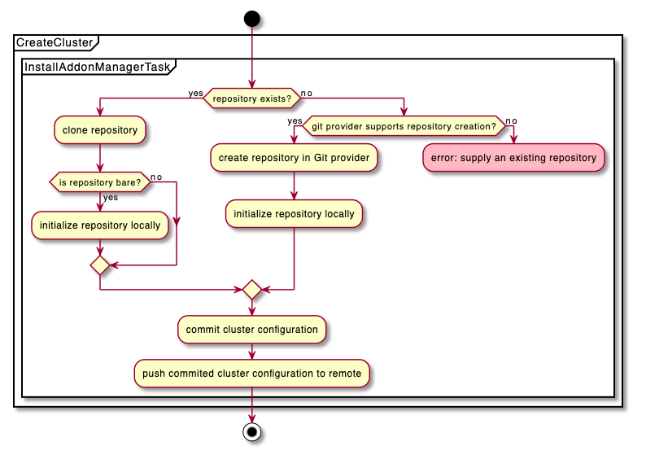

gitproviderdesign.md

# Generic Git Provider for EKS Anywhere GitOps Configuration
## Introduction
EKS Anywhere allows a user to employ a GitOps methodology to manage their clusters. This is achieved using Flux, an open and extensible set of continuous delivery solutions for Kubernetes.

When a customer configures their cluster to use GitOps, they specify a Git provider to act as the source of truth for their cluster configuration. EKS Anywhere then bootstraps Flux onto the users cluster, and Flux is  configured to watch the user provided repository for changes to reconcile.

At launch, EKS Anywhere officially supported cloud hosted GitHub as the only GitOps git hosting provider. This means that an EKS Anywhere user can configure their cluster to use Github as the source of truth for Flux. However, many customers use a variety of hosted and self-hosted Git providers, including but not limited to Github Enterprise, Gitlab, and Bitbucket. Rather than implement an EKS Anywhere git provider for each possible git hosting solution we want to enable customers across the spectrum of use-cases by offering them the ability to use a generic git provider as their source of truth for GitOps. 

By 'generic git provider', we mean provider-agnostic basic authentication to a standard git repository via username/password and/or SSH.

This is a trade-off: our provider-specific Github integration has quality-of-life features, like the ability to create the repository in the remote provider for the user if it does not exist, and to clean it up on cluster deletion. With a provider-agnostic generic git provider this is not possible as we do not have knowledge of the repository-level APIs. However, enabling more EKS Anywhere users to use our GitOps integration more quickly with less work is worth this trade-off, and there is the opportunity to implement
more feature rich, provider-specific git integrations (e.g. Gitlab provider which creates/cleans up the repo at the Gitlab API level) in the future as user demand emerges.

## Goals and Objectives
As an EKS Anywhere user, I want to be able to use a generic git repository with SSH authentication as the source of truth for Flux.

The goal of this design is to unlock the ability for EKS-A users to use any git provider which supports generic authentication methods like SSH authentication as their GitOps provider.

## Tenants
- Supports any generic git providers with password/SSH auth
- Minimal -- simple and straight forward
- No tight coupling preventing abstraction of Flux configuration into a curated package in the future

## Scope
### In-Scope
- addition of a generic git provider
- SSH and password auth for generic git provider

### Out-of-Scope
- provider-specific actions (create, delete repository) for aribitrary git providers
- refactoring to use git executable vs gogit library
- refactoring to use flux git provider Go libraries
- swapping git providers during an upgrade

### Future Work
- ability to swap Git providers during an upgrade

## Overview of Solution
Currently, EKS Anywhere uses a [Github specific Flux bootstrap](https://fluxcd.io/docs/cmd/flux_bootstrap_github/) command to install and bootstrap flux on a new EKS Anywhere cluster (`flux bootstrap github`) and uses the Github API to manage the repository itself (create it during `create cluster`, delete it during `delete cluster`).

In order to support the broadest array of git hosting solutions via basic authentication like SSH and password/username, the generic git provider will simplify this process, accepting basic authentication parameters and passing them to Flux's [`flux bootstrap git`](https://fluxcd.io/docs/cmd/flux_bootstrap_git/) command, bypassing the repository management steps we would take for a specific provider. This will enable users who rely on a variety of Git providers to use GitOps with EKS Anywhere right away.

## User Experience

### Create
The EKS Anywhere CLI user will provide the configuration neccessary to authenticate to their generic git repository via a `git` provider in the `gitOpsConfig` spec. The changes to this spec are discussed in more detail below.

```yaml
apiVersion: anywhere.eks.amazonaws.com/v1alpha1
kind: FluxConfig
metadata:
  name: my-generic-flux-provider
spec:
  fluxSystemNamespace: "my-alternative-flux-system-namespace"
  clusterConfigPath: "path-to-my-clusters-config"
  git:
    repositoryUrl: myClusterGitopsRepo
    username: myGitProviderUserName    
---
```

The CLI will then validate if the repository exists; if it does not exist, it will return a preflight validation error, as we cannot create a repository in a remote with basic auth credentials and no access to the API.

If it does exist, the installation will proceed in the same manner as the current Github integration, cloning the repository locally, initializing it if needed, and committing the EKS Anywhere/Flux system configuration files and pushing the contents to the remote.

### Delete
The delete experience will bypass the deletion of the repository if the generic git provider is used. The configuration files specific to the cluster will be cleaned up as they would otherwise.

## Solution Details
EKS Anywhere uses the `flux bootstrap` command to bootstrap the cluster with the Flux controllers and configure them to use the given provider. We translate the user-provided configuration in the GitOpsConfig spec into command line arguments for the Flux executable and, in the case of a specific provider like GitHub, to calls to the Github API to take specific actions like creating repositories. 

Up until now, we've only called [`flux bootstrap github`](https://fluxcd.io/docs/cmd/flux_bootstrap_github/) and passed in the Github specific configuration along with the Flux specific configuration. However, Flux has a generic git bootstrap command, [`flux bootstrap git`](https://fluxcd.io/docs/cmd/flux_bootstrap_git/), which takes generic basic authentication parameters such as SSH Private key path, password, and username. 

We will take advantage of this fact to translate a basic, provider-agnostic `git` provider in our GitOpsConfiguration spec to arguments for `flux bootstrap git`, bypassing the provider-specific steps along the way.

So, how will this new sequence flow? Let's take a look at how the GitOps bootstrap process would flow during cluster creation.



-  check if the user provided repository exists, using a git provider specific implementation
    - generic git provider will use `git ls-remote` or similar to validate existence of remote and branch ref. 
    - Provider specific methods will be used for specific providers like GitHub, using the provider API to check the status of the remote.
- if the repository does not exist, we determine if we can create it for the user; if we can, we will do so, and initialize it. 
- if the repository does exist, we will proceed as we do today, cloning and initializing it as needed.

Preflight validations will be executed to check the existence of the repository at CLI run time; if it does not exist, and the provider does not support repository creation, we will return a validation error. We will perform another validation durning the flux installation tasks to take care of cases such as the repository being deleted between preflight validations and the start of the task.

The CLI code will check for the presence of a git provider in the method [`BootstrapToolkitsComponents(ctx context.Context, cluster *types.Cluster, gitOpsConfig *v1alpha1.GitOpsConfig)`](https://github.com/aws/eks-anywhere/blob/main/pkg/executables/flux.go#L32), and execute a provider-specific sub method (e.g. `boostrapToolkitsComponentsGit`, `bootstrapToolkitsComponentsGithub`) depending on which provider field is present in the GitOpsConfig (e.g. `Github` is non-nil; `Git` is non-nil, etc). This will execute the logic needed to check for the existence of the repository, call the appropriate `flux bootstrap` command for our provider, and proceed to the generic cloning and initialization tasks.

### `flux bootstrap git`
[`flux bootstrap git`](https://fluxcd.io/docs/cmd/flux_bootstrap_git/) will be called to bootstrap the cluster with the `git` provider.

flux bootstrap git will make use of the following parameters: 
- url: Git repository URL
- password: basic authentication password
- private-key-file: path to a private key file used for authenticating to the Git SSH server

The private key file path, if provided, will allow us to mount the file from the users admin machine filesystem into the flux executable container at runtime.

### API Design
This design will introduce a new config object to the API, a `FluxConfig`. The `FluxConfig` will contain 

The Flux specific configuration, such as `fluxSystemNamespace` and `clusterConfigPath` are at the top level of the  configuration.
There will be multiple, mutually exclusive fields which will allow us to specify the Git provider specific implementation.

### FluxConfig
```yaml
apiVersion: anywhere.eks.amazonaws.com/v1alpha1
kind: GitOpsConfig
metadata:
  name: my-flux-config-with-generic-git-provider
spec:
  flux:
    fluxSystemNamespace: ""
    clusterConfigPath: ""
    git:
      repositoryUrl: ""
      username: ""
    github:
      repository: ""
      personal: false
      owner: "" 
---
```

### Git Configuration Structs
### Flux
The `Flux` configuration will be modified to contain generic flux options `FluxSystemNamespace`, `Branch`, and `ClusterConfigPath`, which will be universal across git providers used in conjunction with Flux.

```Go
type Flux struct {

    Git *gitProviderConfig `json:"git,omitempty"`

    Github *githubProviderConfig  `json:"github,omitempty"`

    // FluxSystemNamespace scope for this operation. Defaults to flux-system.
    FluxSystemNamespace string `json:"fluxSystemNamespace,omitempty"`
    
    // ClusterConfigPath relative to the repository root, when specified the cluster sync will be scoped to this path.
    ClusterConfigPath string `json:"clusterConfigPath,omitempty"`

    // Git branch. Defaults to main.
    // +kubebuilder:default:="main"
    Branch string `json:"branch,omitempty"`
}
```

### GitProviderConfig
The `GitProviderConfig` struct contains the requisite fields for authenticating to a generic git repository using basic auth, either password, SSH or both together. Use of `net/url` for the repository URL provides out-of-the-box validations and assurance of structure.

The PrivateKeyFile and Password values will be supplied by the user via environment variables and supplied to the `flux bootstrap` command.

The private key will need to be mounted in the Flux executable container at execution time to be read by the `flux bootstrap git` command, which accepts a path to a private key file as the input to the bootstrap command; the command will then bootstrap flux with the given configuration and save the private key contents onto the cluster as a secret object.

```Go
type GitProviderConfig struct {
    // Username is the user to authenticate to the git repository with.
    Username string `json:username`

    // Repository URL for the repository to be used with flux. Can be either an SSH or HTTPS url.
    RepositoryUrl net/url `json:repositoryUrl`
}
```

### GithubProviderConfig
The `GithubProviderConfig` struct will contain the required fields to bootstrap flux with github, and not include the `ClusterConfigPath` and `FluxSystemNamespace` fields, which are not specific to Github. It will contain only the fields required to establish a connection to Github -- Owner, Repository, and wether or not it's a Personal repository.
```Go
type GithubProviderConfig struct {
	// Owner is the user or organization name of the Git provider.
	Owner string `json:"owner"`

	// Repository name.
	Repository string `json:"repository"`

	// if true, the owner is assumed to be a Git user; otherwise an org.
	Personal bool `json:"personal,omitempty"`
}
```

### Security
#### Getting Credentials
User may provide a private key, a password, or both.
The private key will be provided via an environment variable containing the path to the private key file.

The password will be provided via an environment variable by the user and later validated to exist by us.

- verify the permissions of the private key file are appropriate (400)
- only accept environment variables for password
- provide documentation on scoping permissions for the provided user appropriately

### Validation
Private Key File:
- file permissions are appropriate (400)
- exists

Password Env Var:
- non-empty

GitOpsConfig:
- ensure that GitProviderRef is valid

Git Repository:
- use `git ls-remote` or equivalent with the provided credentials and remote configuration to verify the presence of the remote and branch ref; validation error if remote branch does not exist.

Repository URL:
- parse into net/url object to ensure formatting is appropriate
- validate that, if a private key file path is provided, the URL is of the appropriate SSH format

### Testing
- E2E GitOps Tests exercising the generic git provider
    - using CodeCommit, GitHub, and ideally one or more other Git providers used by our customers (Bitbucket, GitLab)

### Docs
Docs for new GitOpsRef spec

Update docs to reflect new 'Flux' spec