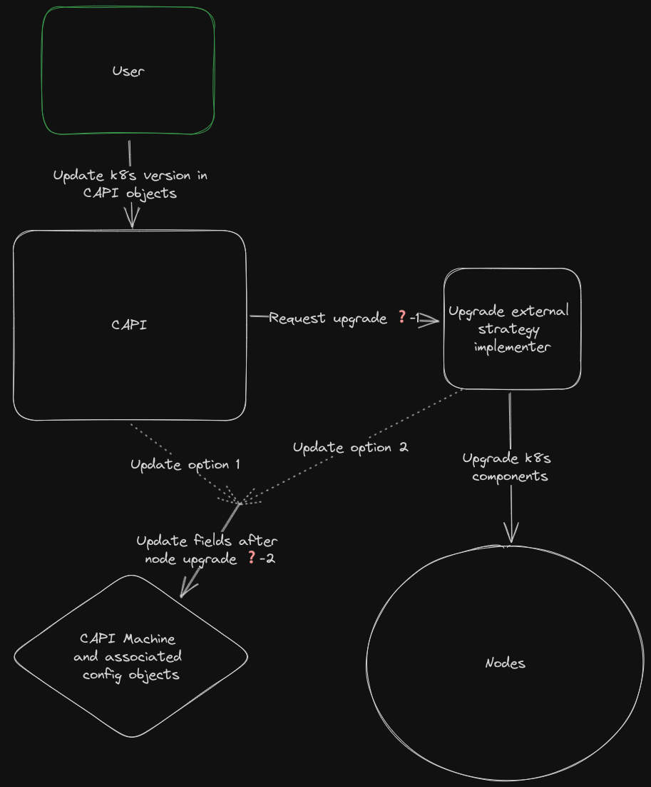
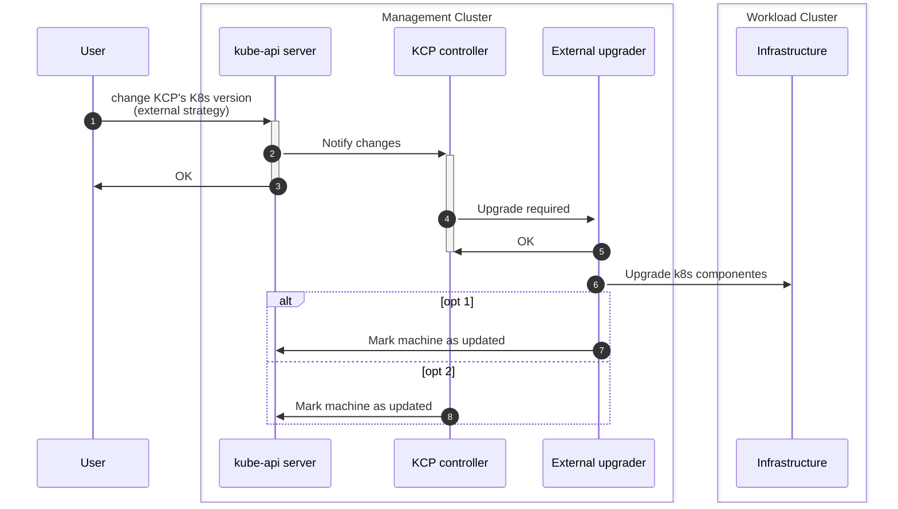
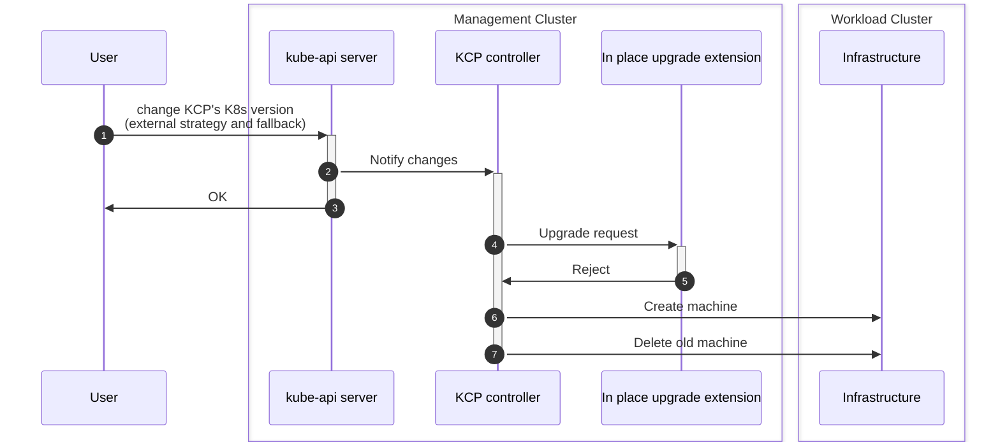
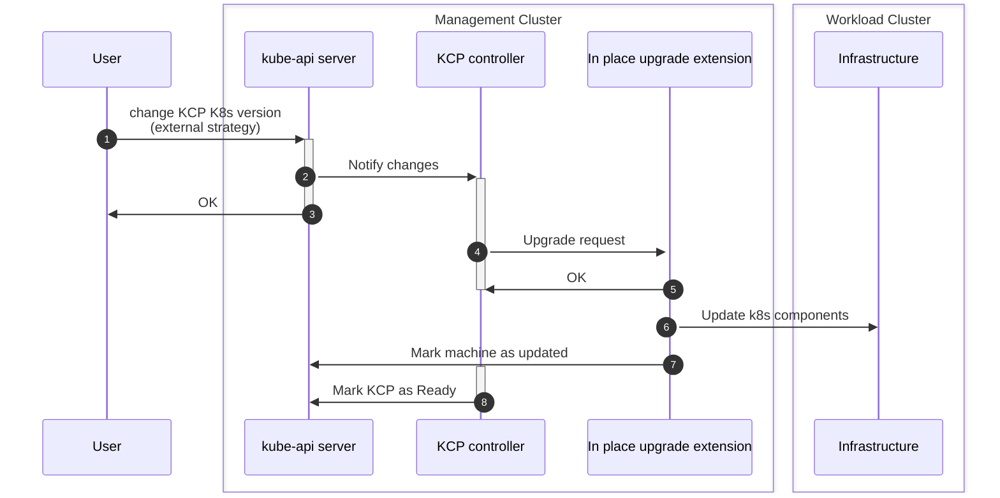

# In-place upgrades in Cluster API
## Introduction
At present, the only supported upgrade strategy in Cluster API is rolling update. However, for certain use cases (such as Single-Node Clusters with no spare capacity, Multi-Node Clusters with VM/OS customizations, etc.), upgrading a cluster via a Rolling Update strategy could either be not feasible or a costly operation (requiring to add new hardware, re-apply customizations...).

In-place upgrades aims to solve this problem by allowing users to perform Kubernetes node upgrades without replacing the underlying machines.

## Goals and Objectives
### User stories
- As a cluster operator, I want to upgrade the K8s version my clusters without loosing any OS changes I have made to the machines and  without needing extra unused hardware.
- As a cluster operator, I want to in-place upgrade my clusters in air-gapped environments.
- As a cluster operator, I want to in-place upgrades to work with my KCP and MachineDeployment controlled nodes.
### Implementation goals
- Avoid "hardcoding" all the new upgrade logic in the existing core/kubeadm controllers.
	- Different users might have different preferences on how to perform these upgrade operations and it seems unreasonable to expect CAPI to meet them all. Requirements around security, access, audit, tooling, OS, infrastructure etc. can variate substantially from environment to environment.
	- Moreover, certain users might already have "provisioning" systems they might want to leverage.
- Maintain a coherent UI/UX between rollout upgrades and in-place upgrades. This means that an in-place upgrade must be triggered in the same way as an rolling upgrade: the user just updates the CAPI objects (KCP, MachineDeployment, etc.). The only difference should be the fields and values configured in those objects.
- Users should be able to keep their cluster running basically indefinitely just with in-place upgrades. This means that theoretically there is no need to ever rollout new nodes: users can keep using in-place upgrades to update their clusters to new k8s versions forever.
  - Note: we can’t guarantee this forever since we don’t know what requirements future versions of kubernetes will have. But at least in theory, updating k8s components and their direct dependencies should be enough to keep the cluster alive “forever”.

## Overview of the Solution
This section will walk from high level idea to concrete implementation. It'll start with a rough component and interaction overview, then list the remaining problems/questions and finish with the individual solutions for each of these questions.

It proposes a pluggable upgrade strategy architecture that allows existing CAPI controllers to delegate the upgrade process to an external entity, enabling replacing the default "rolling update" strategy. It defines the communication patterns to be followed as well as API and behavioral contracts. After the upgrade process is completed, `Machine` (and associated) objects are updated to reflect the k8s component level changes.

### High level view
Both KCP and MachineDeployments controllers follow a similar pattern around upgrades: they first detect if an upgrade is required and then they read the configured strategy to follow one process or another. We can find a configurable upgrade strategy field in the [KCP](https://doc.crds.dev/github.com/kubernetes-sigs/cluster-api/controlplane.cluster.x-k8s.io/KubeadmControlPlane/v1beta1@v1.5.2#spec-rolloutStrategy-type) and [MachineDeployment](https://doc.crds.dev/github.com/kubernetes-sigs/cluster-api/cluster.x-k8s.io/MachineDeployment/v1beta1@v1.5.2) objects. The strategy is supposed to configure “how” machines are upgraded.

Given CAPI's infrastructure immutability constraints, this is currently scoped to just machine replacement (the only available strategy is “rolling update”). What if in-place upgrades can be just another strategy? That fits the current API and abstractions quite well. Moreover, what if the logic to follow by the strategy was implemented outside of the core CAPI controllers?

This solution decouples the core CAPI controllers from the individual possible mechanisms that can be followed for an upgrade. CAPI users could choose to implement their own strategy while leveraging the capabilities of the existing controllers. In addition, they could iterate on those strategies without requiring changes in CAPI.

The only thing that would change from the current UX is configuring the KCP/MachineDeployment with a `strategy: external`. This solution allows to keep leveraging the existing logic in these two controllers to determine when changes are required, so this doesn't need to be replicated elsewhere. Once the need for changes has been determined, these controllers will hit the strategy implementers, informing of the selected Machines and the computed difference between current Machine and desired Machine. The external strategy implementers would take over the process and perform the necessary actions.

Note: the external external strategy pattern is not tied to just in-place upgrades: it could be used to change the machine upgrade order, fine control the timing of each machine upgrade, etc.

The following diagram presents the same idea as above but with a concrete example for the KCP and in a different format, just as additional clarification.

#### Remaining questions
Following the first diagram, all points marked with a ❓:
1. How does CAPI request an upgrade from the external strategy implementer and what information does it need to provide?
2. Who is responsible for updating the CAPI `Machine` and associated objects so the rest of the system detects the upgrade has been completed?
	1. Option 1: the CAPI KCP/MachineDeployment controllers. The external strategy will need a way to signal that the upgrade is completed back to the CAPI controllers.
	2. Option 2: the external strategy implementer that accepted the upgrade request.

### Upgrade external strategy contract
#### Communication pattern
There are two obvious options: webhooks or the "watch resources" Kubernetes controller model (with or without new CRDs). The tradeoffs are mostly the same as in any other system.

CAPI already already uses both:
- CRD/contract based extension for infra, CP and bootstrap providers. These are "plug-in, swappable low-level components" (quoting the Runtime SDK proposal)
- Webhooks for the [Runtime SDK](https://github.com/kubernetes-sigs/cluster-api/blob/main/docs/proposals/20220221-runtime-SDK.md). The Runtime Hooks were designed to enable "systems, products and services built on top of Cluster API that require strict interactions with the lifecycle of Clusters, but at the same time they do not want to replace any low-level components in Cluster API, because they happily benefit from all the features available in the existing providers (built on top vs plug-in/swap)".

A external upgrade strategy seems to fit well in both categories: it's both a *plug-in, swappable low-level component* and it also *does not want to replace any low-level components in Cluster API, because it happily benefits from all the features available in the existing providers*.

We propose to use the Runtime Hooks and Extensions (hence webhooks) because: 
- They align quite well with our goals in two main areas (quoting the proposal):
	- "it will be also possible to use this capability for allowing the user to hook into Cluster API reconcile loops at "low level", e.g. by allowing a Runtime Extension providing external patches to be executed on every topology reconcile". This is exactly what we are trying to do here.
	- "The proposed solution is designed with the intent to make developing Runtime Extensions as simple as possible, because the success of this feature depends on its speed/rate of adoption in the ecosystem."
- Using webhooks doesn't prevent strategy implementers from using a controller.
- It facilitates enforcing an API contract.
- It facilitates "validating" the upgrade request and accept/reject accordingly.

##### Alternatives
- Add an annotation/s to the Machines that need to be upgraded. The strategy implementer can just watch Machines and start upgrading them if it detects the annotation.
  - The annotations will need to contain the requested changes.
- Use the Machine spec as the desired state for the Machine and expect the strategy implementer to detect these changes and reconcile them.
  - This makes it more difficult to have strategy implementers to accept/reject an upgrade request.
  - We will still need a way to tell CAPI controllers the upgrade has been done. Maybe the CAPI controllers add an annotation like `upgrade-needed` and the strategy implementers remove it once the upgrade process has finished.

#### External upgrade strategy Request
At a minimum, the request initiated by CAPI needs to include:
- List of machines that require an upgrade.
- New `Machine` spec.
- New Bootstrap config spec.
- New Infra Machine spec.
- A reference to the `Cluster`.
- A reference to the owner of the Machines that requests the upgrade: CP object (KCP) or "worker group" (`MachineDeployment`).

#### External upgrade strategy Response
Based on the proposed pattern, there is no information that the implementers need to communicate back in the response to CAPI. We can't really make the operation synchronous since upgrades can take an undermined amount of time, so the only thing the implementer needs to do is respond with a 200 OK if it has successfully "started" the process or the appropriate error otherwise.

However, what if the changes detected by CAPI are not scoped down to just a k8s version upgrade? They could involve something else, like running certain extra commands in the host, additional mount points or even configuring users. For example, the current kubeadm config API mixes host level and k8s configuration, which means our in-place upgrade extensions would need to implement a mechanism to reconcile these types of changes as well. This not only can be quite complex but it also can greatly variate from OS to OS. Moreover, what if the detected changes are at the infrastructure Machine level? Depending on the provider, it might even be impossible to make these changes without replacing the machine.

We propose an extension of this pattern that, although simple in its implementation, eliminates the requirement for external implementers to support the full spectrum of upgrade changes. To add some flexibility for the strategy extensions implementers, we will give them the option to decline an upgrade request if they decide they are not capable of performing it. We will also add an option in the KCP/MachineDeployment to optionally configure a `fallbackRolling`, so if all the hooks respond with a "won't do", the controller will continue the upgrade process following this fallback replace strategy. This pattern allows strategy implementers to decide how much of all the possible upgrade scenarios they want to cover and let the system still be able to reconcile any other scenarios they don't cover.

The Response will include at a minimum:
- Boolean indicated of the request is accepted or not.
- A reason message in case the request is declined.

#### Updating CAPI objects after upgrade
We propose putting this responsibility on the strategy implementers for two reasons:
- It barely increases the complexity of the implementers: they already know when the process is completed and should already be capable of identifying the fields and objects that need to be updated (since they need to decide if the requested change is supported or not).
- It simplifies the overall system avoiding the need for a back channel from strategy implementers to CAPI. The CAPI components (KCP/Machine deployment controllers) will simply sit in a loop, checking that a machine needs to be upgraded until the implementer updates the appropriate objects. Then the corresponding KCP/MachineDeployment will be marked as ready.

##### Alternatives
- The KCP/MachineDeployment controllers can make these changes. We will need a way to signal from the external strategy implementer that the upgrade is completed. For example, an annotation in the Machine object.