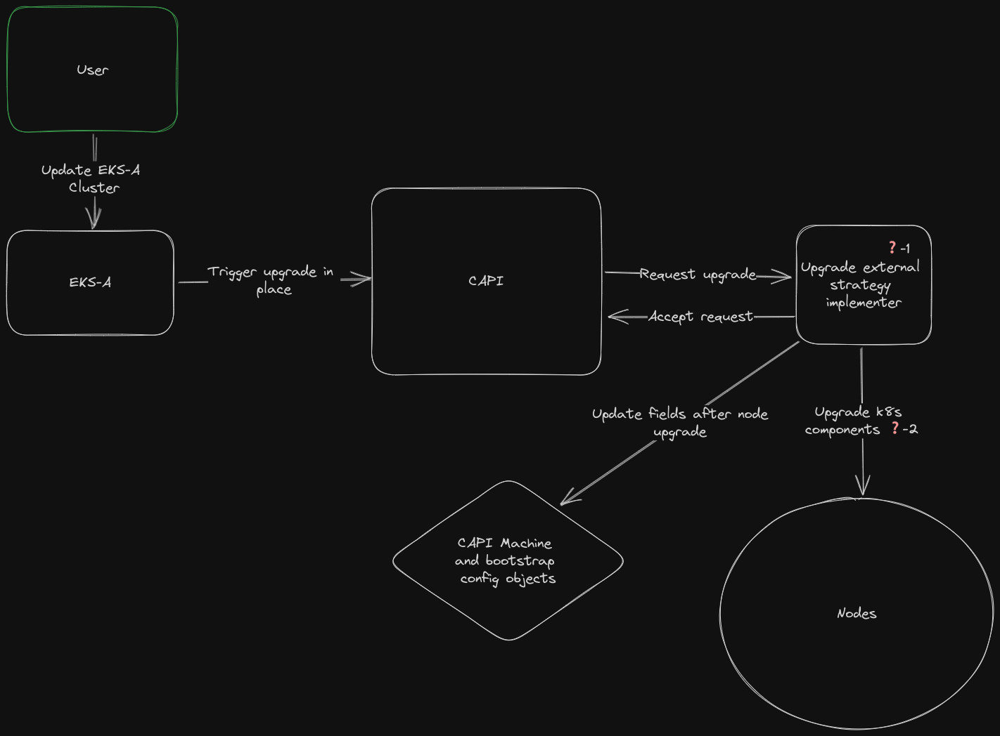
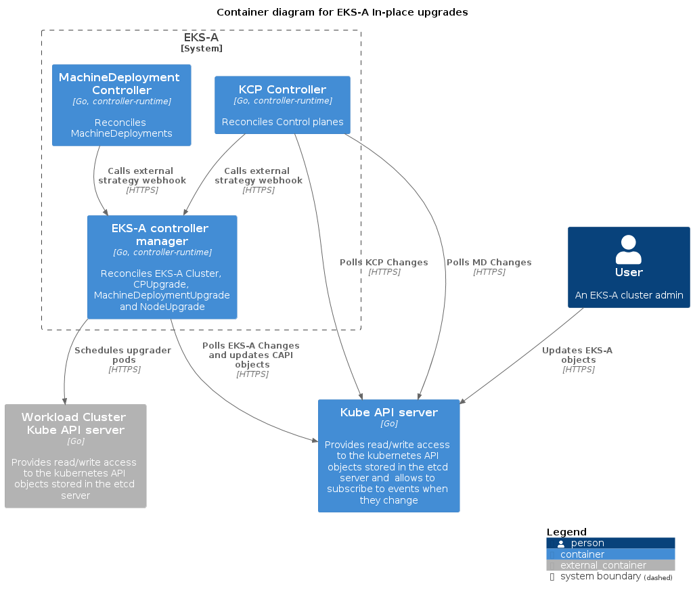
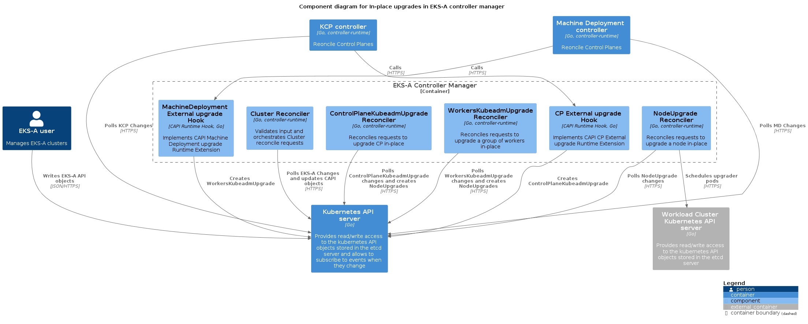

# External upgrade strategy for in-place upgrades
## Introduction
At present, the only supported upgrade strategy in EKS-A is rolling update. However, for certain use cases (such as Single-Node Clusters with no spare capacity, Multi-Node Clusters with VM/OS customizations, etc.), upgrading a cluster via a Rolling Update strategy could either be not feasible or a costly operation (requiring to add new hardware, re-apply customizations...).

In-place upgrades aims to solve this problem by allowing users to perform Kubernetes node upgrades without replacing the underlying machines.

In a [previous proposal](in-place-upgrades-capi.md) we defined how a pluggable upgrade strategy allows to implement in-place upgrades with Cluster API. In this doc we'll describe how we will leverage and implement such architecture to offer in-place upgrades in EKS-A.

### About this doc
This is a a high level design doc. It doesn't answer all the questions or give a complete implementation spec. Instead, it presents a high level architecture: the communication patterns and dependencies between all components and a concrete implementation for each new component.

The goal is to bring enough clarity to the table that a general solution can be agreed upon, so the work can be split by component. Each of these components might present their own challenges that will need to be addressed, at their own time, by their respective owners (with or without a design doc).

## Goals and Objectives
### User stories
- As a cluster operator, I want to upgrade (EKS-A version and/or K8s version) my baremetal clusters without loosing any OS changes I have made to the machines and  without needing extra unused hardware.
- As a cluster operator, I want to in-place upgrade (EKS-A version and/or K8s version) my baremetal clusters in air-gapped environments.
- As a cluster operator, I want to in-place upgrade (EKS-A version and/or K8s version) my single node baremetal clusters.

### Out of scope
* External etcd

## Overview of the Solution
**TLDR**: the eks-a controller manager will host the two webhook servers and implement 3 new controllers that will orchestrate the upgrade. These controllers will schedule privilege pods on each node to be upgraded, that will execute the upgrade logic as a sequence of containers.

### High level view
Following the CAPI external upgrade strategy idea, we can start with the following diagram.



#### Remaining questions
Following the first diagram, all points marked with a ❓:
1. Where does EKS-A implement the in-place upgrade strategy?
2. How does the EKS-A in-place strategy upgrade the components in the running nodes?

### External strategy Runtime Extension
CAPI provides the tooling to register and run a Go HTTP server that implements a particular Runtime Extension. We will use this, serving both the CP and MachineDeployment external strategy Hooks from the EKS-A controller manager container.

These Hooks will only be responsible for accepting/rejecting the upgrade request (by looking at the computed difference between current and new machine spec) and creating the corresponding CRDs to "trigger" a CP/workers in-place upgrade.

### Upgrading Control Planes
We will have a `ControlPlaneKubeadmUpgrade` CRD and implement a controller to reconcile it. This controller will be responsible for orchestrating the upgrade of the different CP nodes: controlling the node sequence, define the upgrade steps required for each node and updating the CAPI objects (`Machine`, `KubeadmConfig`, etc.) after each node is upgraded.
- The controller will upgrade CP nodes one by one.
- The upgrade actions will be defined as container specs that will be passed to the `NodeUpgrade` to execute and track.

This `ControlPlaneKubeadmUpgrade` should contain information about the new component versions that will be installed in the nodes and a status that allows to track the progress of the upgrade. Example:

```go
type ControlPlaneUpgradeSpec struct {
	Cluster                corev1.ObjectReference   `json:"cluster"`
	ControlPlane           corev1.ObjectReference   `json:"controlPlane"`
	MachinesRequireUpgrade []corev1.ObjectReference `json:"machinesRequireUpgrade"`
	KubernetesVersion      string                   `json:"kubernetesVersion"`
	KubeletVersion         string                   `json:"kubeletVersion"`
	EtcdVersion            *string                  `json:"etcdVersion,omitempty"`
	CoreDNSVersion         *string                  `json:"coreDNSVersion,omitempty"`
	KubeadmClusterConfig   string                   `json:"kubeadmClusterConfig"`
}

type ControlPlaneUpgradeStatus struct {
	RequireUpgrade int64 `json:"requireUpgrade"`
	Upgraded       int64 `json:"upgraded"`
	Ready          bool  `json:"ready"`
}
```

#### Validating the upgrade request
This first iteration of EKS-A in-place upgrades won't implement the full spectrum of changes that can be requested through the CAPI API. We will focus on kubernetes version upgrades, which requires updates to the k8s version, CoreDNS version, kube-proxy version and etcd version fields (this fields are in the KCP and MachineDeployment and are reflected in the Machine and KubeadmConfig). Any other field change will end up in a rejected upgrade request. For rejected requests, we could configure CAPI to follow a fallback strategy, or just surface an error. TBD: follow up will be needed by implementers.

However, even for this limited set of allowed changes, there is still a challenge. What happens if a node is taken down and CAPI replaces it? It will create a new one using the template configured in the infra (Tinkerbell) machine template. This will still be pointing to the old one (remember we only allowed updates to component version fields), which means this node will come up with an old Kubernetes version. This might or might not work depending on the version skew (a patch version skew will work, a multiple minor version skew might not).

There are a few ways to go about this:
1. Allow changes to the infra machine template template field. The in-place upgrade strategy will accept requests that change kubernetes component versions and the template, updating the infra machine object after the upgrade to reflect this change. These presents a couple challenges:
   1. The infra machine will reflect a template that wasn't really used for that specific machine. Any new updates/changes baked into the template that weren't present in the previous one will be missing in this machine, which can confuse operators looking to troubleshoot something.
   2. Some infra machines might be immutable. This doesn't include `TinkerbellMachine` so for this baremetal implementation this pattern works. But it might not work in the future for other providers.
2. Keep the infra machine template unchanged but perform an in-place upgrade on any new machine that is brought up with the old template. This requires the node to come up first, which means it only solves the problem for a version skew between the cluster and the template allowed by kubeadm. In addition, it requires a way to signal to our new controllers that this new machines require an in-place upgrade.
3. Make CAPI ignore differences between the infra machine template for a particular node group (CP or `MachineDeployment`) and the template in the infra machine object. This way, we could update the infra machine template so new machines get created with the new template but we avoid the need of having to patch the existing infra machine objects. This will require some changes in the CAPI API and/or contracts so KCP and MachineDeployment controllers handle this scenario appropriately.

More thought is required in this area so it will require a follow up.

### Upgrading MachineDeployments
We will have a `WorkersKubeadmUpgrade` CRD and implement a controller to reconcile it. This controller will be responsible for orchestrating the upgrade of the worker nodes: controlling the node sequence, define the upgrade steps required for each node and updating the CAPI objects (`Machine`, `KubeadmConfig`, etc.) after each node is upgraded.
- The controller will upgrade worker nodes in the same `WorkersKubeadmUpgrade` one by one.
- The upgrade actions will be defined as container specs that will be passed to the `NodeUpgrade` to execute and track.

This `WorkersKubeadmUpgrade` should contain information about the new component versions that will be installed in the nodes and a status that allows to track the progress of the upgrade.

#### Upgrading nodes
We will have `NodeKubeadmUpgrade` CRD and implement a controller to reconcile it. This controller will be responsible from scheduling a pod on the specified workload cluster node with the specified containers as `initContainers`. It will track their progress and bubble up any error/success to the `NodeKubeadmUpgrade` status. The status should also allow to track the progress of the different upgrade "steps".





### Running the upgrade process on nodes
The node upgrade process we need to perform, although different depending on the type of node, can be generalized to these steps:
1. Copy new component binaries to host.
2. Upgrade containerd.
3. Upgrade CNI plugins.
4. Update kubeadm binary and run the `kubeadm upgrade` process.
5. Drain the node.
6. Update `kubectl`/`kubelet` binaries and restart the kubelet service.
7. Uncordon de node.

Each of this steps will be executed as an init container in a privileged pod. For the commands that need to run "on the host", we will use `nsenter` to execute them in the host namespace. All these steps will be idempotent, so the full pod can be recreated and execute all the containers from the start or only a subset of them if required.

Draining and uncordoning the node could run in either the container or the host namespace. However, we will run it in the container namespace to be able to leverage the injected credentials for the `ServiceAccount`. This way we don't depend on having a kubeconfig in the host disk. This not only allows us to easily limit the rbac permissions that the `kubectl` command will use, but it's specially useful for worker nodes, since these don't have a kubeconfig with enough permissions to perform these actions (CP nodes have an admin kubeconfig).

In order to codify the logic of each step (the ones that require logic, like the kubeadm upgrade), we will build a single go binary with multiple commands (one per step). The `ControlPlaneKubeadmUpgrade` and `WorkersKubeadmUpgrade` will just reference these commands when building the init containers spec.

#### Optimizations
The previous makes assumes all cluster topologies need the same steps, for the sake of simplicity. However, this is not always true and knowing this cna lead to further optimize the process:
- Single node clusters don't require a drain+uncordon. The workload pods have nowhere to go, so these 2 steps take extra time and (possibly) add unnecessary downtime (if workloads don't depend on the control plane, they should keep working mostly uninterrupted).
- Clusters without nodes with extra capacity don't benefit from drain+uncordon. Given the drain operation is done preemptively in case the node fails to keep running the pods, if those pods can't be scheduled elsewhere, draining is unnecessary.

Since we have each step as a container, it's easy to optimize the upgrade process by making some steps optional/dynamic based on the configuration.

### The upgrader container image
We will build an image containing everything required for all upgrade steps:
- K8s component binaries: `containerd`, CNI plugins, `kubeadm`, `kubelet`, etc.
- `nsenter`
- `cp` (to copy binaries to host).
- Our custom upgrade Go binary.

This way, the only dependency for air-gapped environments is to have an available container image registry where they can mirror these images (the same dependency we have today). The tradeoff is we need to build one image per eks-a + eks-d combo we support.

We will maintain a mapping inside the cluster (using a `ConfiMap`) to go from eks-d version to upgrader image. This `ConfigMap` will be updated when the management cluster components are updated (when a new Bundle is made available). The information will be included in the Bundles manifest and just extracted and simplified so the in place upgrade controllers don't depend on the full EKS-A Bundle.

## Customer experience
### API
In-place upgrades will be an option for baremetal clusters and the rolling update will remain the default upgrade strategy. This means users need to be able to configure this through our cluster spec. Ideally, this behavior should be configurable per node group: CP and individual worker node groups.

We might also want to allow users to configure a fallback strategy to rolling update in case the requested changes are not supported by in-place upgrades or to not have a fallback and just fail.

This is only shown as an example, and API change proposal (no need for a doc, just propose the changes to the team) will be needed here.

```yaml
apiVersion: anywhere.eks.amazonaws.com/v1alpha1
kind: Cluster
metadata:
  name: my-cluster
spec:
  eksaVersion: "0.19.0"
  controlPlaneConfiguration:
    count: 3
    machineGroupRef:
      kind: TinkerbellMachineConfig
      name: my-cluster-cp
    upgradeRolloutStrategy:
      type: InPlace
  datacenterRef:
    kind: TinkerbellDatacenterConfig
    name: my-cluster-dc
  workerNodeGroupConfigurations:
  - name: md-0
    count: 3
    machineGroupRef:
      kind: TinkerbellMachineConfig
      name: my-cluster-worker-1
    upgradeRolloutStrategy:
      type: InPlace
```

### Observability

The EKS-A cluster status should reflect the upgrade process as for any other upgrade, with the message for `ControlPlaneReady` and `WorkersReady` describing the reason why they are not ready. However, users might need a more granular insight in the process, both for slow upgrades and for troubleshooting.

The `ControlPlaneKubeadmUpgrade` and `WorkersKubeadmUpgrade` will reflect in their status the number of nodes to upgrade and how many have been upgraded. In addition, they will bubble up errors that happen for any of the node upgrades they control.

In addition, `NodeKubeadmUpgrade` will reflect in the status any error that occurs during the upgrade, indicating the step at which it failed. It will also reflect the steps that have been completes successfully. If there is an error and the user needs to access the logs, they can just use `kubectl logs` for the failed container. Once the issue is identified and fixed, they can delete the pod adn our controller will recreate them, restarting the upgrade process.

The upgrader pod won't contain sh, so user won't be able to obtain a shell with it. If interactive debugging is required, they can always use a different image or use SSH access directly on the node.

## Security

This proposal doesn't drastically change the rbac of our controller, it just adds permissions for the new CRDs we will own and patch permission for `Machine` and `KubeadmConfig`. Given it already had permissions to create this machines though higher level entities, this does't seem like a dangerous change.

Although true that the EKS-A controller will now be creating pods in the workload clusters, it already had admin permissions on them due to having access to the CAPI kubeconfig secret. So this is not a big swift either.

However, the use of privileged containers, specially with an image containing `nsenter`, entails some risks. If an attacker were to obtain control of any of these containers while they are running (they won't stay running forever since they exit on success/failure and are never restarted), they would obtain control of the host machine. For a CP machine, this means being admin in the cluster and having access to the raw tcd data.

In order to mitigate this risk we will follow the following good practices:
- Make the upgrader image minimal in surface. We will only include whatever is strictly necessary as enumerated in a previous section.
- Perform automated image scanning on the upgrader image.
- Perform automated vulnerability scanning on the upgrader binary's code.

## Testing

All the code needs to be unit/integration tested, including new controllers and the upgrader binary.

In addition, we will add the following scenarios to be tested in our E2E suite:
- Kubernetes patch version upgrade for all supported k8s versions. This can be done by running an upgrade from the previous minor release, which always contains a different eks-d release. This needs to be tested for both CP and worker nodes.
- Kubernetes minor version upgrade for all supported k8s version. This needs to be tested for both CP and worker nodes.
- Fallback scenario where the upgrade changes are not supported by in-place upgrades and it fallback to a rolling update strategy.
  
## Appendix
### Technical specifications
- Support only for Ubuntu.
- Support for single node clusters without extra hardware. This means cleaning up + reinstalling won’t work, since the etcd data will be contained only on this node.
- Downtime of workloads is acceptable. It’s up to the user to configure them in a way that the are resilient to having one node down.
- Given the requirements, in some cases (like single node), CP downtime is acceptable.
- HA control planes should not have API server downtime, except for however long kube-vip takes to do the fail over (for clusters using kube-vip). If the user is running custom workloads in the CP nodes, these might have downtime if they are not enough compute resources to run them when one node is down.
- Support for air-gap. This means that all the components to be upgraded in a node need to packaged and stored somewhere.
- `apt` updates and any other OS level customization by the customer are supported, but only on components not managed by eks-a.
- Host components owned by eks-a 
	- container runtime
	- CNI plugins
	- kubeadm
	- kubelet
	- kubectl
	- CP static pods (as in any other eks-a cluster)
- EKS-A will only manage upgrading the eks-a managed components. Everything else like OS, additional packages, etc. will be handled by the user.
- In the EKS-A API the default upgrade strategy should still be the current rolling upgrade.
- Nodes should follow the kubernetes setup of image builder for ubuntu: kubelet running with `systemctl`, `containerd` as the container runtime, etc.