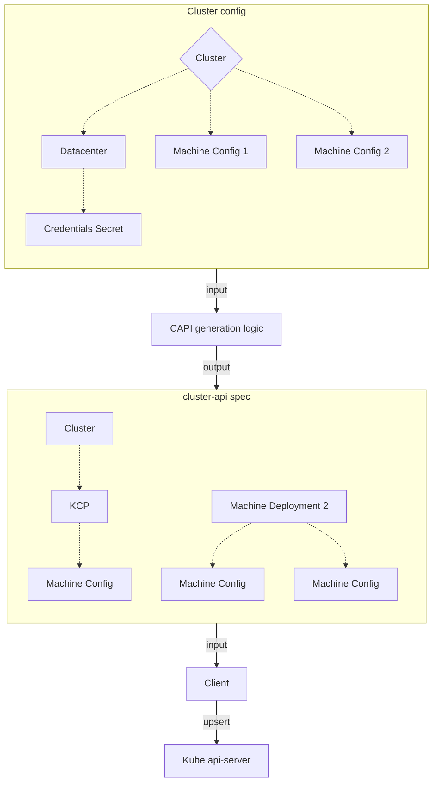
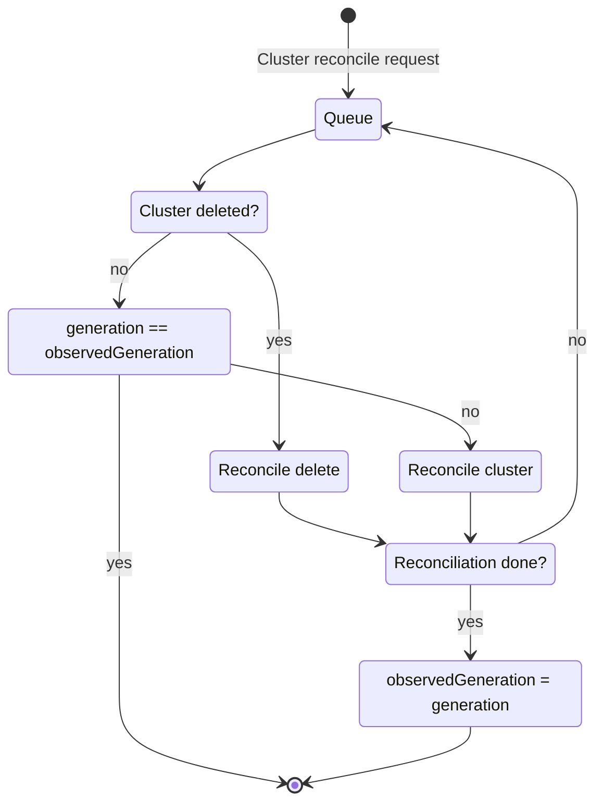
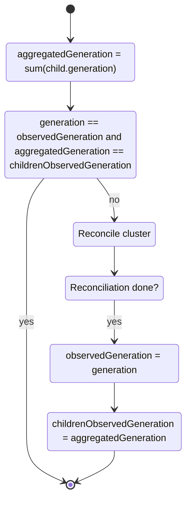

# Isolate workload clusters from management cluster upgrades

## Problem statement

When a management cluster is upgraded, it's management components are also upgraded. This includes the EKS-A controller manager. Given this controller contains the logic to "convert" the EKS-A to the cluster-api API, any changes to this logic between one EKS-A version to the next one can trigger unexpected (for the user) cascading changes in the workload clusters. In some scenarios, those changes can cause machine rollouts.

### The EKS-A cluster controller
Reducing to the simples expression, the EKS-A controller follows this logic:
1. Read the cluster config (EKS-A `Cluster` object plus all linked objects).
1. Using the cluster config as input, generate the `cluster-api` cluster spec (the combination of all CAPI custom resources that define a cluster).
1. Upsert these CAPI objects (create them if they don't exist, update otherwise).


For more detailed information, consult the [controller design doc](https://github.com/aws/eks-anywhere/blob/main/designs/full-cluster-lifecycle-api.md).

### When is the issue more likely to happen?

Any new feature we add that involves API changes is usually opt-in, or at least not enabled by default in existing clusters. This makes easier to write the generation logic in a way that produces the same output for a particular input, since we can count on the input to change before having to "configure" the new feature on the CAPI side.

However, it's with defaults where this issue becomes more relevant. Not necessarily with defaults on the EKS-A API but with defaults we set on the CAPI side that are not a direct consequence of a particular EKS-A input. We could call this the base CAPI spec. These are the values that are set regardless of the EKS-A API input. Although these don't change very often, when they do, it becomes difficult to make those changes opt-in.
### Has this happened before?
There have been a few times where a change in the CAPI "generation logic" caused unwanted rollouts in workload clusters.

For example, we made a change to the logic that generates the [KCP for Cloudstack](https://github.com/aws/eks-anywhere/pull/3566) in order to set correctly the hostname. Although a valid and useful addition, this change affects the bootstrap data which requires a machine rollout in order to reconcile the change.

Another example could be [this](https://github.com/aws/eks-anywhere/pull/3402) (although it was fixed pre-release so the bug was never shipped). This time, we wanted to change the content of one of the files we copy to the machines. An API version changed in between Kubernetes versions and we just updated to newest one. Again, since this file is part of the bootstrap data, new machines needed to be rolled out to reconcile the changes.

### Will this happen again?
Although we should strive to make all new CAPI config "opt-in", so it only affects new cluster or cluster where the user specifically request such changes, it's possible that we might find situations where this is not possible. As mentioned before, the "base cluster-api spec" is where this is most likely to happen.

Is for those edge cases where there is no other way but to change the cluster-api output that this design is trying to find a solution for. 

## Tenets
1. **Simple**. Prioritize (in order): simple for the user, simple to maintain, simple to implement.

## Goals
1. As a cluster operator, I want to upgrade my management clusters without new machines being rolled out in the workload clusters.
2. As a cluster operator, I want EKS-A to fully take care of the upgrade process, I don't want to have to manually update the workload clusters before I upgrade the management cluster.

## Scope
### In
* Design a system that prevents, working transparently to the user, new machines from being rolled out in workload clusters when the management cluster is upgraded.
### Out
* Decouple management components update from cluster components upgrade in management clusters.

## Solution
Use the Kubernetes concepts of `generation` and `observedGeneration` to determine when an cluster configuration has changed and only then, reconcile the state of the world to the desired state. This prevents workload clusters from being affected by a management cluster upgrade: if a workload cluster config has already been reconciled and its `generation` matches its `observedGeneration`, no changes will be applied to the CAPI definition of the cluster unless the EKS-A cluster config changes again, regardless if the CAPI cluster definition generated for the same EKS-A cluster config has changed between controller versions.

### `generation` and `observedGeneration`
* [`metadata.generation`](https://github.com/kubernetes/community/blob/master/contributors/devel/sig-architecture/api-conventions.md#metadata): a sequence number representing a specific generation of the desired state. Set by the system and monotonically increasing, per-resource. May be compared, such as for RAW and WAW consistency.
	* [For CRDs](https://kubernetes.io/docs/tasks/extend-kubernetes/custom-resources/custom-resource-definitions/#status-subresource): The `.metadata.generation` value is incremented for all changes, except for changes to `.metadata` or `.status`.
* [`status.observedGeneration`](https://github.com/kubernetes/community/blob/master/contributors/devel/sig-architecture/api-conventions.md#typical-status-properties): is the `generation` most recently observed by the component responsible for acting upon changes to the desired state of the resource. In other words, the value of the `observedGeneration` field indicates the last time the controller updated the status subresource. This can be used, for instance, to ensure that the reported status reflects the most recent desired status.

### Workflow: how to use `observedGeneration` to only reconcile on changes
This diagram represents the logic to follow in the EKS-A `Cluster` controller:



We only perform the actual reconciliation logic (this is trying to change the state of the world) when `observedGeneration` is different than `generation`. This will only happen after the resource has changed.

It's important to mention that we only update the value of `observedGeneration` when the reconciliation process is "done". Done here means that the state of the world is equal to the desired state: the cluster has been completely reconciled. This is to take into account the case where a full reconciliation takes multiple loops (for example, when the cluster is first created). Note that "reconcile not done" also includes errors.

This might be slightly different of how other resources use the `observedGeneration` field, where the field is always set on every reconciliation loop. For multi state resources (like our `Cluster`) this is usually accompanied of a "state" indicator (note that `phases` is now discouraged in favor of `conditions`). However, we don't have that in our `Cluster`'s status. Although tempting to try to add this to the status, we encourage to tackle this problem separately and revisit the use of `observedGeneration` if necessary. Refer to the [alternatives](#alternative-solutions) section for other possible solutions.

### Cluster vs cluster config: how to calculate an aggregated generation
An astute reader might have realized that until now we have worked with a simplified model: one where cluster reconciliation only needs to occur when the resource been reconciled (the Cluster in this case) changes. Although this is true for most controllers in Kubernetes, our Cluster controller doesn't behave this way. Due to the particularities of our API and how we define a single entity (the cluster config) with multiple CRDs (all linked through the `Cluster` object), the Cluster controller reacts to changes not only in the `Cluster` but also in all its linked objects (we'll call them child objects for the rest of the document).

Now, the question becomes: how do we reflect child objects changes in the `observedGeneration`? Since all our CRDs, including the child objects, have a `generation` field, we can simply add all of them into one aggregated cluster config `observed`. The are two different ways for a referenced object to change:
* If a child object reference is changed to a different object, `Cluster` object's `generation` will change, increasing the aggregated cluster config's generation.
* If the reference is kept pointing to the same object, but the child object is changed, this will increase its `generation`, which also increases the aggregated cluster config's generation.
$$aggregatedGeneration = \sum_{n=1}^{clusterConfigObjs} generation_n$$


#### Hidden `generation` changes
Although it covers most of the scenarios, this solution still leaves in edge case unsolved. While `generation` can only be increased for a certain object, by changing a child object reference to a different object we can make the aggregated generation go down, or even worse, stay the same. The latter is bad since we will identify that reconcile request as a no-op, hence no reacting to the changes. This can happen if a referenced gets changed to child object with a $generation = prevObjGeneration -1$. That decreased will be compensated by the increase in the `Cluster`'s generation.

The most straight forward solution is to keep track of two generations: the `Cluster` 's generation and the aggregated generation for the child objects. 
* If any reference changes, the  `Cluster` 's generation will increase.
* If any child object changes, the aggregated child object generation will increase. Note that multiple child objects changing at once won't be a problem since their generation can only increase.

So now the logic becomes:



### API changes
We propose adding two fields to the `Cluster` status:

```go
type ClusterStatus struct {
	...
	// observedGeneration represents the .metadata.generation the last time the
	// cluster was successfully reconciled.
	ObservedGeneration int64 `json:"observedGeneration,omitempty"`

	// childrenObservedGeneration represents the sum of all cluster's linked
	// objects's .metadata.generation the last time the cluster was successfully reconciled.
	ChildrenObservedGeneration int64 `json:"childrenObservedGeneration,omitempty"`
}
```

### Risks and doors
Although it involves API changes, and as any other API change it should be approached with caution, we consider the proposed solution a two way door:

* It's an internal mechanism not exposed to users that we are free to change as we please.
* Even if this document is lengthy, the solution should be quite simple to implement, both in length and scope (overall codebase footprint). This should minimize the effort required to change it for a different solution.

We can document the new API fields as internal and subject to change their meaning in future releases.

#### Drift correction
The biggest disadvantage of this solution is losing the ability to correct drift: if a user, or any other entity with enough permissions, changes the CAPI objects directly (hence affecting the real state of the cluster) we won't be able to react to this until any of the EKS-A objects composing the cluster config are updated. Although the controller shouldn't have any problem reconciling this new state of the cluster once the EKS-A cluster config is updated, this behavior is not ideal since it, in a way, breaks the control logic model.

Although a change in behavior, and hence worth mentioning in this doc, this should not be a problem from the user point of view. We don't support modifying CAPI objects directly and we don't guarantee correctness if the user decides to do it. If the user decides to do it, they are on their own. Hence removing the ability to undo those changes is not a break of the system's contract.
#### Unexpected rollouts
The proposed solution prevents workload clusters from being affected when the management cluster is upgraded. But what happens when a workload cluster's config is updated the first time after the management cluster is upgraded? It will not only reflect the changes in the EKS-A API, but also any changes derived from the difference in business logic between the old and new EKS-A cluster controllers. In the worst case scenario, this difference in logic can trigger a machine rollout, even if the updates to the EKS-A API didn't require one (for example, scaling down a worker node group).

This shows how the proposed design doesn't fully solve this problem in all scenarios. It just postpones the needed for a rollout in a way that users can deal with workload clusters in a controlled and explicit manner.

We need to clearly document this behavior so users can plan accordingly when updating their workload clusters after a management cluster upgrade.

## Version skew
Although it's possible today to continue upgrading a management cluster without updating the workload cluster's `Bundles` (the versions of all components in a EKS-A cluster), we lack a maximum skew version between management and workload clusters.

Since this proposal makes the isolation between management and workload clusters even bigger, we propose to add to our documentation a maximum skew version support of one minor version. This means the management cluster can only be one EKS-A minor version after the workload clusters. It's important to note that this particular skew rule is not required for the proposed design to work properly and it's only included here to delimit the amount of maintenance work.

Given clusters are not explicitly tagged to a particular EKS-A version (but implicitly through their `bundlesRef`), we recommend not adding a validation yet that prevents more than one minor version bumps. We recommend to tackle this problem first: moving to a model where clusters have a direct reference to its EKS-A version (**its** EKS-A version is whichever version was used to populate its component versions).

We encourage to try to identify changes that can break controller support for clusters in old versions and make it clear in our release notes. Based on experience, we anticipate than, even if it not officially supported, users will still try to perform skip upgrades. The more obvious we make to them the situation where this can fail, the better.

## Alternative solutions
### Multiple controller copies
When upgrading the management cluster, we could keep old versions of the cluster controller for workload clusters (by maintaining versioned deployments). As the workload clusters get upgraded and this old versions become unused, we would delete the corresponding deployments. Each controller would only reconcile clusters tied to their own version. This guarantees a management cluster upgrade won't affect workload clusters since they will still be controlled by the existing version of the controller.

#### Pros
* Allows drift detection
* No unexpected rollouts.
* No special handling business logic in the controller, just a "filtered" watch.
#### Cons
* More resource consumption
* Scales poorly with number of supported versions. With the proposed support model, at most only two versions of the controller need to be maintained, but if this were to change, the maintenance complexity will increase linearly.
* Increases the complexity by requiring a new component to manage the lifecycle of the cluster controller, something like an EKS-A operator.
* Requires specially logic to manage controllers other than the `Cluster` controller. Right now all controllers are bundled in the same shared controller manager. If we were gonna have multiple active copies of the cluster controller, we would either need to split it in its own deployment or add special logic to the other controllers so they don't conflict with each other (leader election at the controller level, object sharding, etc.).

### Composable `cluster-api` generation
Instead of the current monolithic (for lack of a better word) approach to generate the CAPI cluster definition, we could move to a layered model, where each EKS-A version adds another layer on top of the previous one.

```go
type generationLogic func(capiSpec) capiSpec
type layer struct {
	version semver.Version
	logic []generationLogic
}

var layers = []layer{
	{
		version: semver.Version{Major: 0, Minor: 0, Patch: 0},
		logic: []generationLogic{baseGeneration},
	},
	{
		version: semver.Version{Major: 0, Minor: 16, Patch: 0},
		logic: []generationLogic{
			addNewKubeletFlags,
			addExtraCyphers,
		},
	},
	{
		version: semver.Version{Major: 0, Minor: 16, Patch: 3},
		logic: []generationLogic{
			skipKubeadmValidation,
		},
	},
}

func generateCAPI(clusterVersion semver.Version) capiSpec {
	spec := capiSpec{}

	for _, layer := range layers {
		if clusterVersion.LessThan(layer.version) {
			break
		}

		for _, generate := range layer.logic {
			spec = generate(spec)
		}
	}

	return spec
}
```

#### Pros
* Allows drift detection.
* No unexpected rollouts.
* Potentially infinite extensibility to support a bigger version skew.
#### Cons
* Increases codebase maintenance work. When support for a certain version is removed, that version's "layer" logic should be incorporated into the base generation logic so the complexity doesn't grow forever. This can also be prone to regressions.
* It becomes increasingly difficult to navigate the logic that goes from EKS-A input to CAPI output. The code is the single source of truth for this process and it becomes vital when trying to understand the system's behavior (when debugging an issue or simply trying to add a new feature). This approach makes building this mental model more difficult.
* It requires more testing, since each version (layer) requires its own set of tests.

It's important to note that this approach only works when generating CAPI objects using go structs. So it becomes almost a pre-requisite to move away from the yaml + go templates combo that EKS-A currently uses.

## Testing
Testing if the implemented solution solves the stated problem, outside of unit/integration tests, becomes quite tricky. It will require to change the controller's logic in a way that affects the output CAPI cluster definition.

It's possible to use one of the drawbacks of the solution, drift detection, to test that *it's working*. However, this means testing the implementation and not the behavior, so we discourage this option.

We recommend building robust unit tests, using the highest level possible entity (the controller). We also propose to extend the existing `TestCloudStackKubernetes123ManagementClusterUpgradeFromLatest` test to all providers. This test performs a management cluster upgrade from the previous minor version to the new one and verifies in a loop that none of the machines in the workload clusters change.