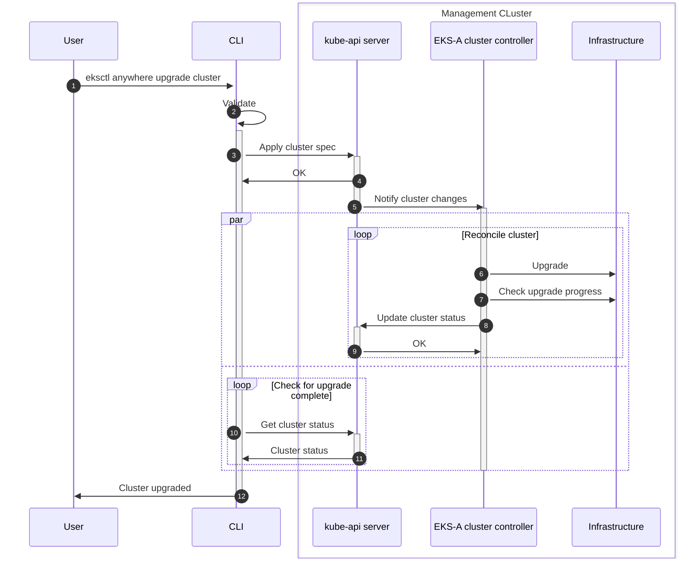

# Kindless upgrades

## Introduction

EKS-A uses a `kind` cluster to perform self-managed cluster (aka management cluster) upgrades. This has turned to be a potential source of issues when the upgrade process doesn't go smoothly, making the system fragile and difficult to recover from errors. Our goal is to remove it.

Recent manual testing has proved that is indeed possible to upgrade a self-managed cluster from within itself by leveraging the EKS-A new full lifecycle controller. The rest of this docs outlines the necessary work to integrate this feature with the CLI and proposes initiatives and improvements to mitigate risks as well as increase the confidence in this feature before releasing it officially.

>This is not a formal technical design doc, just an outline of necessary work. Each of these work items might or might not require a design doc of their own.

### History

When the `upgrade` operation was designed, it was decided that upgrading a cluster from within itself was too risky. So to mitigate this risk, a bootstrap cluster is created, using kind, and the management resources are moved to it. Then the `upgrade` operation is orchestrated from within the bootstrap cluster. Once it completes successfully, resources are moved back to the original cluster and the bootstrap cluster is deleted.

The CAPI community advised against upgrading a self-managed cluster from within due to the risk of leaving the cluster in an unrecoverable state. The theory claims that if something goes very wrong with the upgrade and it leaves either the api server or etcd in a non working state, the CAPI controllers would be incapable of healing the cluster due to their dependency on the API server (and as an extension, etcd). This would leave the operator with very little room to maneuver since they would have lost access to the data stored in the CAPI resources as well as the ability to interact with its API. Given EKS-A's dependency on CAPI, the same concern applies to all EKS-A clusters.

The community's concerns seemed solid and resonated with the team's understanding of the system. Given the complexity described this feature entails, the limited time to implement this operation before GA and the limited experience of the team with CAPI, the team lacked the resources to try to confidently implement self-managed upgrades by themselves. Hence, it was decided to follow the community's advice.

## CLI integration

This section describes the work required to implement this new architecture in the CLI `upgrade` command.

### Validation webhook

The current validation webhook prevents management clusters from being upgraded directly through the API. We need to change this to allow the CLI to leverage the controller for the upgrade.

This presents the question: should we allow users to leverage the API to upgrade management clusters or should this be restricted to the CLI? This conditional limitation can be implemented using an annotation (for example the existing `managed-by-cli`). It's left up to the implementer to document pros and cons and help the team reach an agreement.

### Cluster status

In order for the CLI to track the progress made by the controller, we will use the `Cluster` object status. This will allow the CLI to not only show the current state of the upgrade process to the user but more importantly, to block until the upgrade process is completed.

This will have its own design doc, which is already in progress.

### Upgrade workflow changes

The upgrade workflow needs to be updated to reflect this new architecture:

* All bootstrap cluster operations and adjacent code should be removed.
* The "upgrade needed" step is not needed and can be removed.
* Pausing the EKS-A cluster needs to be removed, however, pausing the Flux controller is still needed.
* Cilium upgrade needs to be removed from the core components upgrade task, since the controller takes care of this.
* The upgrade task itself needs to be re-implemented. We recommend implementing in outside of the workflow, using the [new workflow tasks](https://github.com/aws/eks-anywhere/blob/main/pkg/workflow/task/workload/create.go) as inspiration. It should follow the following steps:

    1. Update EKS-A resources with the user provided user spec using a Kubernetes client.
    2. Watch/pull the cluster status, following the upgrade process. Beware of race conditions/caches and make sure we leverage `generation`/`observedGeneration` appropriately.
    3. Blocking until the cluster is `Ready` or timeout is reached.

* `reconcileClusterDefinitions` needs to be split and some parts reordered.
    * Creating the new `Bundles` and EKS-D manifest in the cluster (in case of EKS-A version upgrade) needs to be moved up in the workflow, before core components upgrade.
    * Updating the EKS-A resources is not needed, since the upgrade task already does it.
    * All the GitOps operations should remain in this task.
* Consider keeping a task to perform a backup of CAPI resources before applying any changes to the EKS-A cluster spec.

## Initiatives

The rest of the document focuses can be divided on two main topics: how to increase our confidence on upgrading self-managed clusters without a `kind` cluster and how to mitigate the risks of this operation, both by reducing the chances of something bad to happen and by reducing the impact if they do.

### Empirically looking for edge cases: continuous testing

The EKS-A CLI's upgrade operation has evolved over time, becoming more and more robust. Based on customers' experience and our own, we have changed the order of steps, made them more modular, tweaked the logic, added extra validations... Moving to an architecture where the EKS-A controller performs the upgrade does not only imply a significant paradigm change, but it abruptly changes the code path. Although the knowledge and experience gained during the last two years is embed in the FLC controller, this code path change for management cluster upgrades will entail, in a way, renouncing to all the edge-case handling we have built over time.

In order to increase our confidence on this change, we will leverage our experience to try to find any edge cases that this new architecture could introduce. We will create a set of automated tests that run continuously through different scenarios and registering failures. This will allow us to investigate and find edge cases where special handling could be useful to avoid intermittent issues.

* Scenarios to test across providers:
    * k8s upgrades 1.24 → 1.25 → 1.26 → 1.27
        * External etcd
        * Stacked etcd
    * Scaling up
        * External etcd
        * Stacked etcd
    * Single and multi-node CP
* Bare-metal will need a special test for single node cluster.

We decide to run this separately from the main E2E CI to shorten the feedback loop. These only run on PR merges and they sometimes take up to 5h to complete. Running a smaller set of tests (which should reduce the execution time) in a continuous loop should increase the number of data points we obtain in the same period of time.

The tests stats need to reflect if the tests failed during the upgrade or not, which is what matters here. If it failed at create or delete, just mark the tests as invalid, but not necessarily failed, so we don't invest time investigating the flake.

It's important to remember that speed here is key, the sooner we get this running, the more data we will have. We should favor speed over perfection: use any tools at your disposal and avoid trying to automate everything.

### Mitigating risks: a more robust reconciliation loop

#### Separating etcd from CP changes

Currently, the controller performs changes to the etcd cluster and CP all at once in one single step. This is no a problem from a workflow perspective, since the etcdadm cluster, CAPI cluster and KCP controllers orchestrate the operation in the right order. However, it makes recovering from an error more difficult since there are more changes to "rollback".

Most of the time when an upgrade fails, it shows up in the first etcd node not coming up. By making the etcd changes a separate step in the upgrade process, we reduce the amount of changes to rollback in case of an issue. If the first etcd node doesn't come up, the etcd cluster spec can be manually changed to its previous version and the new machine deleted, leaving the cluster in the same state as before.

This new pattern introduces a new problem with the way the etcdadm cluster, core CAPI cluster and KCP controllers interact and will require changing it, or at least make the current behavior optional. Right now, the system is designed to apply all the CP changes at once, so it orchestrates itself making that assumption. If this we don't change this, it will cause a double CP upgrade, one after etcd finishes the upgrade (when it updated the endpoints secret) and a second one after updating the KCP.

#### Waiting for control plane to be fully upgraded

The current implementation of the controller first upgrades the CP and the just waits for `ControlPlaneReady` condition in the cluster object before continuing with the rest of the reconciliation (CNI, workers, etc.).

This is not enough. There can be delays, creating a race condition where the status of the CAPI cluster is not updated fast enough after updating the KCP. This is more common when using external etcd, since the KCP won't be `NotReady` until etcd is upgraded.

This implementation needs to extended to look at the KCP instead of the CAPI cluster, making sure `generation` and `observedGeneration` are leveraged to avoid trusting outdated statuses.

This could make the reconciliation process take longer for control planes with a lot of nodes, since the controller would wait until all new nodes have joined the cluster and all the old ones have been removed. In order to speed things up, we might not need to wait until the whole CP is upgraded before moving on with the next phases. It might be enough with just waiting for the first control plane node to be upgraded (so first new machine created and first old machine deleted).

This gives us good confidence the CP upgrade is going well. That said, since the next phase involves upgrading the CNI at that can affect networking, we recommend starting with extra caution and just wait for the whole CP to be upgraded (all new machines created and ready, all old machines deleted).

That said, the "first node wait" strategy can still be a great alternative for workload clusters, given their upgrade process is less risky.

#### Leaving `kube-vip` CP node for last

One of the mentioned concerns with having a kindless cluster upgrade is the possibility of the management controllers (EKS-A and CAPI) to lose access to the API server if something goes wrong. One of the reasons this can happen is if kube-vip fails to do the fail-over to a different node when the node that currently own the vip is removed (as part of the rolling upgrade).

To reduce the chances of this happening, we can minimize the amount of transitions the vip goes through by leaving the node currently holding the vip to be deleted last. This guarantees only one transition since this will be to an already upgraded node.

It's not clear if the KCP provides a mechanism to control the order in which the CP nodes are rolled out, this requires more investigation. If it doesn't, we could simply implement this as a patch, using a special annotation to denote the last `Machine` to be deleted.

#### `kube-vip` as part of a CP Machine health

Another way we can make the CP rollout more robust is by making sure the `kube-vip` pod is running correctly in a new CP node before continuing with the next one. This reduces the chances of an old being deleted with a healthy kube-vip pod ready to take over the vip.

This also requires more investigation to see if CAPI provides any mechanism to add an extra health check to a particular set of machines.
