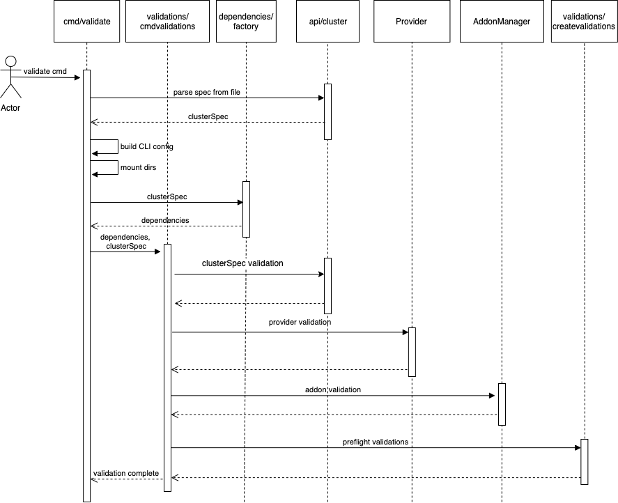

# Preflight Validate Design Document

* * *

## Introduction

**Problem:** Users do not have a method to validate configuration files to be used with EKS Anywhere without attempting to create a cluster. 

With more complex provider configurations, users may need to review and modify their configuration multiple times before arriving at a valid configuration for cluster creation. Running the `create cluster` command for validation commits the user to attempting to create a cluster and generates artifacts that need to be removed.

### Tenets

* **Simple:** simple to use, simple to understand, simple to maintain
* **Informative:** output should lead user to take action and guide next steps 
* **Non-invasive:** minimal permanent changes should be left as a result of this command
* **Intuitive:** validation should be accomplished following the same patterns users have come to expect with EKS-A CLI

### Goals and objectives

As a Kubernetes administrator I want to:

* Validate EKS Anywhere configurations without running `create cluster`
* Validate required resources are available prior to cluster creation 
* Receive informative feedback about configuration and resource readiness

### Statement of scope

**In scope**

* Existing preflight validation checks for `create cluster` are run with `exp validate create cluster` command
* Adding more in-depth provider validations should be prioritized on a per-provider basis
* Ensure design is extensible to easily incorporate additional validations in the future

**Not in scope**

* Creating an exhaustive list of additional preflight checks 
* Large scale changes to documentation

**Future scope**

* Additional general preflight validation checks
* Additional in-depth validation for additional providers
* Validation for the `upgrade cluster` command

## Overview of solution

EKS Anywhere includes extensive preflight checks already run as part of the create cluster command. These validations will be incorporated into an independent `validate` command. This command will initially be introduced as a subcommand under the `exp` command to indicate this is an experimental command. 

The existing validations should continue to be run as part of  `create cluster`  to prevent any possible regressions or invalid cluster creation from being overlooked.

### Architectural design

#### Validations Overview

The `validate` command architecture will differ from the `create cluster` workflow by first creating all the necessary dependencies to run validations, then running all validations aggregated together in the validations/createcluster package. The initial dependency generation will be a prerequisite for the the validations and any failure during dependency generation will result in an err response for the command. 

Running the validations together after dependency generation will allow better aggregation for the validation results, as well as ensure that the `validate` runs all validations possible instead of returning early on individual validation failure. 

Ideally, the dependency generation process for any individual component should be separate from its validation to enable this architecture and allow the generation and validations to be called independently and/or together as needed.

#### Sequence Diagram


#### Validation Location

The `validate` command relies on logic in the following locations to run the `create cluster` validations. This does not include all code dependencies for the `validate` command. 

```

.
└── eks-anywhere
    ├── cmd/eks-a/cmd
    │   ├── experiment.go
    │   ├── validate.go
    │   ├── validatecreate.go
    │   └── validatecreatecluster.go
    └── pkg
        └── validations
            └── createcluster
                ├── createcluster.go
                └── createcluster_test.go

```


Primary validation components called by validations/createcluster include the following:

* General `create` validations under `pkg/validations/createvalidations` ([link](https://github.com/aws/eks-anywhere/blob/b4a4eb84c03091d1a646c1e49b9760b8b63961d3/pkg/validations/createvalidations/preflightvalidations.go))
    * `validate` will continue to run the general `create` validations in `validations/createvalidations` as part of the preflight checks to ensure a single source of truth for maintenance and consistency in user experience

* Provider specific validations under pkg/providers ([link](https://github.com/aws/eks-anywhere/blob/621a05272404b1d17c15e040007b4a14c9d0499b/pkg/providers/vsphere/vsphere.go#L372))

* Addonmanager/addonclients validation ([link](https://github.com/aws/eks-anywhere/blob/b4a4eb84c03091d1a646c1e49b9760b8b63961d3/pkg/addonmanager/addonclients/fluxaddonclient.go#L289))
    * fluxaddonclient
* Additional individual validation functions in validations/createcluster called directly to replicate `create cluster` validation tasks

#### Usage:

`exp` - subcommand, introduce all subcommands as experimental

`eksctl anywhere exp validate create cluster [flags]`

* **Flags**:

    `-f, --filename string Filename that contains EKS-A cluster configuration`

    `-z, --hardware-csv string Path to a CSV file containing hardware data`

    `-tinkerbell-bootstrap-ip string Override the local tinkerbell IP in the bootstrap cluster`

* **Global Flags:**

    `-v, --verbosity int Set the log level verbosity`

### Dependencies and consumers

The preflight check relies on the existing validations used by `create cluster` .  In order to keep the user experience consistent, `validate` should inform the user of situations where a `create cluster` would fail. 

## Major considerations

### User Experience

For now, the only way to validate a cluster configuration is by running `create cluster`.

After the preflight check command is created, users will be able to run only the validations for `create cluster` by invoking `exp validate create cluster -f workload-spec.yaml` . Users can then run this command as in preparation for configuration or during a proof of concept phase.  The usage of this command is in-line with other EKS-A CLI commands and should provide a unified user experience.

Targeted user experience is to receive a full list of validation failures and a suggestion for remediation on the error if available.

### Security

The preflight validations should be minimally invasive and not result in artifacts left after run.

Currently there are already safeguards in place to redact any personal and credential information during validations. These safeguards should also be incorporated into any new validations added. 

## Alternative designs

We chose to add the `validate` command to EKS-A as opposed to creating a standalone preflight check utility. A standalone utility would add to the steps needed to run validations and require separate deployment. Users would be more likely to skip this or not leverage the preflight check functionality as a result.

Additionally, an independent command was chosen instead of modifying the existing create cluster command to run validations only for simplicity in execution as well as to allow the `validate` command to be expanded independently of `create cluster`.
