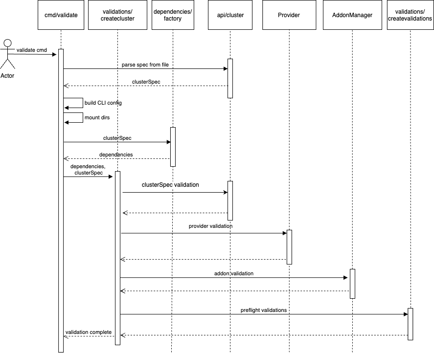

# Preflight Checks Design Document

* * *

## Introduction

**Problem:** Users do not have a method to validate configuration files to be used with EKS Anywhere without attempting to create a cluster. 

With more complex provider configurations, users may need to review and modify their configuration multiple times before arriving at a valid configuration for cluster creation. Running the create cluster command for validation commits the user to attempting to create a cluster and generates artifacts that need to be removed.

### Tenets

* ****Simple:**** simple to use, simple to understand, simple to maintain
* **Informative**: output should lead user to take action and guide next steps 
* **Non-invasive:** no permanent changes should be left as a result of this comman**d**
* **Intuitive:** validation should be accomplished following the same patterns users have come to expect with EKS-A CLI

### Goals and objectives

As a Kubernetes administrator I want to:

* Validate EKS Anywhere configurations without running `create cluster`
* Validate required resources are available prior to cluster creation 
* Receive informative feedback about configuration and resource readiness

### Statement of scope

**In scope**

* Preflight validation checks can be run independently of `create cluster`
* Existing preflight validation checks are run with `validate` command
* Adding more in-depth provider validations should be prioritized on a per-provider basis
* Ensure design is extensible to easily incorporate additional validations in the future

**Not in scope**

* Creating an exhaustive list of additional preflight checks 
* Large scale changes to documentation

**Future scope**

* Additional general preflight validation checks
* Additional in-depth validation for additional providers
* Validation for the `upgrade cluster` command

## Overview of solution

EKS Anywhere includes extensive preflight checks already run as part of the create cluster command. These validations will be incorporated into an independent `validate` command. The `validate` command will be easily extensible for additional preflight-specific validations and different provider configurations.  

The existing validations should continue to be run as part of  `create cluster`  to prevent any possible regressions or invalid cluster creation from being overlooked.

### Architectural design

#### Validations Overview

The `validate` command includes validations from the following locations originally based off the `create cluster` command validations. This does not include all code dependencies for the `validate` command. The `cmd/eks-a/cmd/validations.go` validations are not currently being called by `create cluster` and can be moved to a more suitable location once dependencies are resolved.

```
.
└── eks-anywhere
    ├── cmd/eks-a/cmd
    │   ├── preflight.go
    │   └── validations.go
    └── pkg
        ├── addonmanager/addonclients
        │   └── fluxaddonclient.go
        ├── api/v1alpha1
        │   └── cluster.go
        ├── providers
        │   ├── cloudstack
        │   ├── docker
        │   ├── snow
        │   ├── tinkerbell
        │   └── vsphere
        └── validations
            ├── createvalidations
            │   └── preflightvalidations.go
            ├── docker.go
            └── input.go
```

New validation for `validate` should be added following the same validation architecture when possible. Validations should be separated into configuration-specific validations that can be preformed directly based only off the provided configuration file, and ones that require provider access or queries to be run.  The configuration-specific validations can be run independently of provider validations for users that want config only validation or whose provider environment may not be ready yet.

Primary validation components include the following:

* General `create` validations under `pkg/validations/createvalidations` ([link](https://github.com/aws/eks-anywhere/blob/b4a4eb84c03091d1a646c1e49b9760b8b63961d3/pkg/validations/createvalidations/preflightvalidations.go))
    * `validate` will continue to run the general `create` validations in `validations/createvalidations` as part of the preflight checks to ensure a single source of truth for maintenance and consistency in user experience

* Provider specific validations under pkg/providers ([link](https://github.com/aws/eks-anywhere/blob/621a05272404b1d17c15e040007b4a14c9d0499b/pkg/providers/vsphere/vsphere.go#L372))

* Addonmanager/addonclients validation ([link](https://github.com/aws/eks-anywhere/blob/b4a4eb84c03091d1a646c1e49b9760b8b63961d3/pkg/addonmanager/addonclients/fluxaddonclient.go#L289))
    * fluxaddonclient
* Additional miscellaneous methods called directly for preflight validation

#### Sequence Diagram


The `validate` workflow primarily deviates from the `create cluster` workflow by defining the validation options and ValidateTask within the preflight cmd. The `create cluster` workflow utilizes SetAndValidateTask which proceeds to call the CreateBootStrapClusterTask after finishing validations while `validate` will terminate after successful validation.


#### Usage:

`eks-a validate [flags]`

* **Flags**:

`-f, --filename string Filename that contains EKS-A cluster configuration`
`-l, --lint only perform configuration formatting checks  `
Additional flags may be necessary for prior `create cluster` arguments

* **Global Flags:**

`-v, --verbosity int Set the log level verbosity`

### Dependencies and consumers

The preflight check relies on the existing validations used by `create cluster` .  In order to keep the user experience consistent, `validate` should inform the user of situations where a `create cluster` would fail. 

## Major considerations

### User Experience

For now, the only way to validate a cluster configuration is by running `create cluster`.

After the preflight check command is created, users can run just the validations for EKS-A as by invoking `validate -f workload-spec.yaml` . Users can then run this command as in preparation for configuration or during a proof of concept phase.  The usage of this command is in-line with other EKS-A CLI commands and should provide a unified user experience.

### Security

The preflight validations should be minimally invasive and not result in artifacts left after run.

Currently there are already safeguards in place to redact any personal and credential information during validations. These safeguards should also be incorporated into any new validations added. 

## Testing

The new code will be covered by unit and e2e tests, and the e2e framework will be extended to support the `validate` command.

The following e2e test will be added:

Scenario 1 - run preflight check successfully

* run preflight check on valid configuration
* proceed with cluster creation if successful

## Alternative designs

We chose to add the `validate` command to EKS-A as opposed to creating a standalone preflight check utility. A standalone utility would add to the steps needed to run validations and require separate deployment. Users would be more likely to skip this or not leverage the preflight check functionality as a result.

Additionally, an independent command was chosen instead of modifying the existing create cluster command to run validations only for simplicity in execution as well as to allow the `validate` command to be expanded independently of `create cluster`.