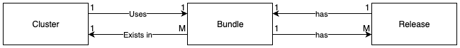

# Refactor Cluster Version and Dependencies

## Introduction

In order to check EKSA version skews when upgrading a cluster, there is a need to know the EKS-A version used to create/upgrade a cluster. Currently, there is no direct way of getting the current cluster version. This design doc will describe changes to the EKS-A ClusterSpec to determine the current EKS-A version. A cluster’s dependencies vary by EKS-A release, so this document will also describe new CRDs to help determine which bundle is needed for a release. Currently, we use BundlesRef to determine which bundle to use, but if the current cluster version is known, then EKS-A can implicitly determine which bundle to use since each release points to a single bundle manifest.

During the creation/upgrade of a cluster, EKS-A installs a bundle that corresponds to the CLI version. Each EKS-A release maps to a single bundle manifest. However, different releases can map to the same bundle manifest. In other words, one bundle can map to many releases. 
Currently, many bundles CRD instances can exist in an EKS-A cluster. However, a cluster only uses one of those bundles at a time. The cluster’s BundlesRef field determines which bundle in the cluster to use. 

### CRD Relationships


## Context

In the future, we want to add a preflight validation to prevent customers from skipping minor versions of EKS-A when upgrading a cluster. For example, we want to discourage users from upgrading a cluster created with v0.13.X to v0.15.X, but allow an upgrade from v0.14.X to v0.15.X. This is because we only test upgrades from minor version skews of increments of 1. Performing upgrades in increments greater than 1 can introduce unexpected problems. This document will not cover this preflight validation.

## Goals

Currently, getting the upgrade version is simple, but there is no direct way to get the current cluster version. Therefore, the first goal is to introduce a way to determine the current cluster version.

Since release versions are closely tied to dependencies we also want to determine which bundle to use in a cluster based on the current cluster version rather than relying on the BundlesRef field. 

As an EKS Anywhere user, I want to:

* know the EKS-A version last used to manage a cluster (current cluster version)
* manage a cluster without worrying about which bundle goes with which EKS-A release version

## Proposed Solutions

### Cluster to Bundle Relationship before solution


### Cluster Version

The preferred solution is to add a new field indicating the EKS-A version to the ClusterSpec and update it whenever the CLI creates or upgrades the cluster. This new field can be called EKSAVersion and it would make BundlesRef redundant as the bundle can instead be derived from the version. 

### Dependencies

Since dependencies can be determined from the cluster version, we can deprecate the BundlesRef field. Currently, the BundlesRef field is used to reference the bundle object existing within the cluster. BundlesRef lives within the ClusterSpec and tells EKS-A which bundle to use for that cluster. We still need to know which bundle to use for a cluster, so we should add a new CRD to map EKSAVersion to a bundle. We also still need to specify custom bundles for debugging purposes. This can be done by creating an instance of the new CRD that points to the custom bundle and changing EKSAVersion to point to that instance of the new CRD. This solution is preferred because it provides a simple way to get the EKS-A version of a cluster along with a way to determine which bundle to use without directly referencing one within a cluster.

### Cluster to Bundle Relationship after solution


## Scenarios to handle

The preferred solution would require us to handle differences between existing clusters and new clusters regarding the changes to ClusterSpec. 

1. For new clusters, we would need a webhook validation that only admits EKSAVersion while preventing the user from passing the deprecated BundlesRef.
2. For existing clusters where the BundleRef isn’t changing, we can continue to use BundlesRef to get the bundle since these clusters won’t have EKSAVersion.
3. For existing clusters that users try to upgrade with a new bundle, the BundlesRef should be nullified and EKSAVersion should be added. The CLI must ensure EKSAVersion is passed when BundlesRef is nullified. Any change to BundlesRef other than nullification should be rejected.
4. For workload clusters created with Full Lifecycle, default to the management cluster’s EKSAVersion if none is specified. Users can optionally specify EKSAVersion when upgrading with FLC, so that users can upgrade both management and workload clusters separately from each other. There would need to be a validation that checks if the specified version actually exists within the releases manifest and is within two minor versions below or equal to the management cluster. To prevent users from breaking their clusters, we should have an upgrade validation to check if management clusters are already two minor versions above any of their workload clusters. If specified when using the CLI, then there should be a validation to ensure the specified version matches the CLI version.
    1. EKSAVersion is only populated on create and upgrade operations. Existing workload clusters would not populate the EKSAVersion field if only the management cluster is upgraded.
    2. Additional validation on upgrade to prevent setting EKSAVersion to nil when already set to prevent flux from removing the field in a GitOps managed cluster.

In any of these scenarios, only one of the two fields should be passed. There should never be a case where both are passed.

## Implementation Details

Add a new string type and mutable field called EKSAVersion. The new field should go under ClusterSpec. Mark the BundlesRef field as deprecated and mention the newly added field as its replacement. 

To map the versions to bundles, we can introduce a new CRD called EKSARelease. For each EKS-A release version, there should be a single EKSARelease object in the cluster. The EKSARelease object should include the version scheme in its name (e.g. eksa-v0-15-3) to make it easy to identify the EKSARelease object from the EKSAVersion field. There should be a function, which handles this conversion from EKSAVersion to EKSARelease.ObjectMeta.Name if we choose to name instances of the new CRD differently than EKSAVersion. 

The EKSARelease CRD should have a spec containing relevant data about the release from EksaRelease as well as a BundlesRef field. The BundlesRef can be used to get the Bundle.

Instances of EKSARelease and each of its fields should be immutable and can be created from the releases manifest. Rather than making a get call to download the releases manifest, the manifest can be added to the EKS-A repo and embedded into the CLI at compile time.  The release process should be modified to dynamically update the file within the EKS-A repo. Our current release process just uploads the modified manifest to an S3 bucket.

```go
type EKSAVersion string


type ClusterSpec struct {
    KubernetesVersion             KubernetesVersion              `json:"kubernetesVersion,omitempty"`
    ControlPlaneConfiguration     ControlPlaneConfiguration      `json:"controlPlaneConfiguration,omitempty"`
    WorkerNodeGroupConfigurations []WorkerNodeGroupConfiguration `json:"workerNodeGroupConfigurations,omitempty"`
    DatacenterRef                 Ref                            `json:"datacenterRef,omitempty"`
    IdentityProviderRefs          []Ref                          `json:"identityProviderRefs,omitempty"`
    GitOpsRef                     *Ref                           `json:"gitOpsRef,omitempty"`
    ClusterNetwork                ClusterNetwork                 `json:"clusterNetwork,omitempty"`
    // +kubebuilder:validation:Optional
    ExternalEtcdConfiguration   *ExternalEtcdConfiguration   `json:"externalEtcdConfiguration,omitempty"`
    ProxyConfiguration          *ProxyConfiguration          `json:"proxyConfiguration,omitempty"`
    RegistryMirrorConfiguration *RegistryMirrorConfiguration `json:"registryMirrorConfiguration,omitempty"`
    ManagementCluster           ManagementCluster            `json:"managementCluster,omitempty"`
    PodIAMConfig                *PodIAMConfig                `json:"podIamConfig,omitempty"`
    Packages                    *PackageConfiguration        `json:"packages,omitempty"`
    // BundlesRef contains a reference to the Bundles containing the desired dependencies for the cluster
    BundlesRef *BundlesRef  "<-- Deprecate this field"
    EKSAVersion *EKSAVersion "<-- Add this field"
}
```

```go
// +kubebuilder:resource:scope=Cluster
type EKSARelease struct {
  metav1.TypeMeta                
  metav1.ObjectMeta              
  Spec EKSAReleaseSpec           
}                                

type EKSAReleaseSpec struct {                   
    // +kubebuilder:validation:Required         
    // +kubebuilder:validation:Type=string      
    // +kubebuilder:validation:Format=date-time 
    Date string `json:"date"`
    
    // +kubebuilder:validation:Required
    // EKS-A release version
    Version string `json:"version"`
    
    // +kubebuilder:validation:Required
    // Git commit the component is built from, before any patches
    GitCommit string `json:"gitCommit"`
    
    // +kubebuilder:validation:Required
    // Manifest url to parse bundle information from for this EKS-A release
    BundleManifestUrl string `json:"bundleManifestUrl"` 
    
    // Reference to a bundle in the cluster
    BundesRef BundlesRef     
}                                               
```

## Alternative Solutions

An alternative solution is to improve the relationship between the bundle and CLI to map from bundle to CLI. Currently, one bundle can have a relation to many CLI versions. We would need a one-to-one relationship between the bundle and CLI in order to map from bundle to CLI. Once that relationship is enforced, the bundle mentioned in the cluster’s BundlesRef can be used to find the CLI version. This solution is not preferred because a specific bundle still needs to be referenced within the cluster whereas the CLI can figure out which bundle to use on its own with the preferred solution. 
An advantage of this alternative is being able to specify your own BundlesRef for debugging purposes. However, using a different bundle would still be possible with the preferred solution as you could create your own EKSARelease and change EKSAVersion to point to that EKSARelease.

An alternative to creating a new CRD to map version to bundle would be to use ConfigMaps. While ConfigMaps would be simpler to implement, especially in terms of immutability, CRDs have the advantage of being strongly typed. By using a CRD, we can ensure the data is complete and has an expected shape that is easy to read even if users create their own EKSARelease.
