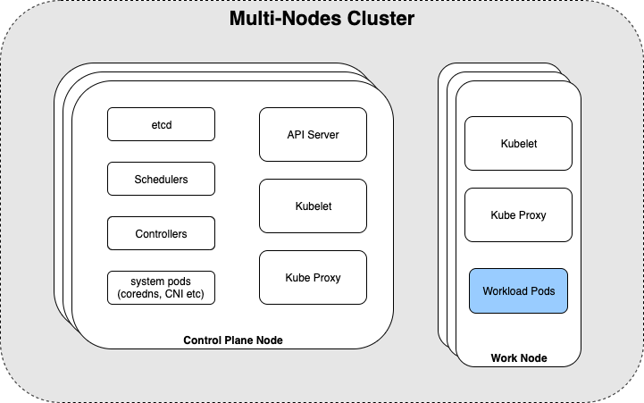
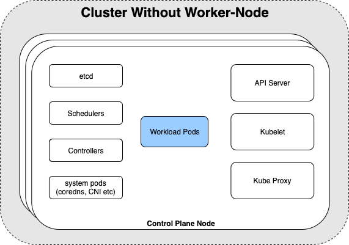
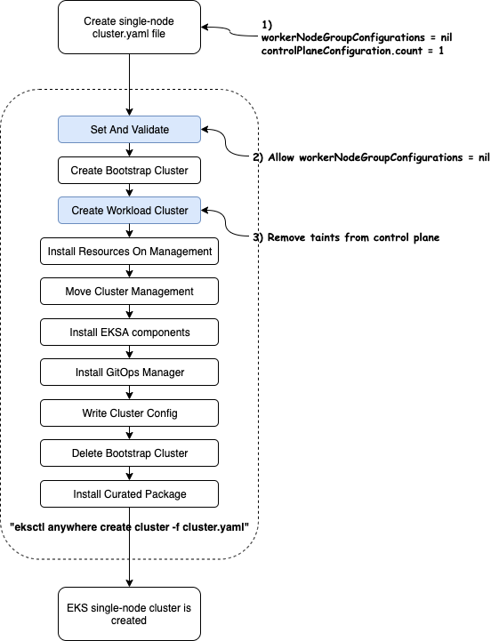

# Single Node Cluster

## Introduction

Some customers want to run Kubernetes on a single server. In response to this demand, we have done a POC to investigate EKSA single-node cluster support.

In the POC, we have proved that single-node k8s deployment are possible by running workloads on the control plane node. From there, we will do testing and validation of various components, such as cilium, kube-vip, to ensure there are no issues running everything on one node.

## Goals and objectives

Allow cluster administrators to use EKS-A CLI to manage their single-node clusters like how they managing their multi-node clusters.

### Statement of scope

**In scope**


1. Design the interface for creating single-node cluster
2. Modify EKSA so it can create/delete single-node clusters correctly
3. Test and validate the single-node cluster created by EKSA, 1) out of box CPU/Memory usages should be smaller than 2 core / 8gb for Ubuntu 20.04 Bare Metal server, 2) all kube-system/eksa-system pods should be running correctly. 

The above items applies to all infrastructure providers, but *Tinkerbell is our first priority.*

**Out of Scope**

1. Achieve high availability for single-node cluster

**Future scope (forward looking)**

1. Upgrade single-node cluster (rolling upgrades and in-place upgrades), including changing the single-node cluster to a multi-nodes cluster. Customer cares more about kubeversion update. 
2. Removing built-in pods to give more compute resources to workload. Right now, we are in a good position with the claim of 2 core / 8gb requirement and the situation will be improved even further if we deploy a separate management cluster to run management pods. We’ll prioritize rolling out a beta version so we can get performance feedback and determine whether to further optimize core component resource usage before to GA.

**Tenets**

* *Minimum:* minimize interface/code change, minimize the compute resources used by single-node cluster
* *Ubiquitous:* single-node cluster is supported for all providers (vSphere, Tinkerbell, Docker, etc.) with the same interface
* *Complete:* all k8s API resources are supported in single-node cluster, a workload that can run in multi-node cluster should be portable to single-node cluster.

## Solution Overview

In a multi-node kubernetes cluster, there are control-plane nodes and worker nodes. The control-plane nodes run infrastructure services like schedulers, proxy, controller-managers etc, while the worker nodes run mainly workload pods, besides kubelet and kube-proxy.


To create a single-node kubernetes cluster, we need to remove worker nodes, since they don't run the infrastructure components. Worker nodes' workloads pods will transfer to the control-plane. 


The transfer can be done by removing the taint (https://kubernetes.io/docs/concepts/scheduling-eviction/taint-and-toleration/) (node-role.kubernetes.io/master:NoSchedule) from the control plane nodes.


## Design Details 

Process for cluster administrators to create a k8s cluster with EKSA: 

1. Get an admin machine, install EKSA CLI
2. Create a cluster definition file in yaml (if using tinkerbell, a hardware.csv is also needed)
3. Run command `eksctl anywhere create cluster -f cluster.yaml`
4. K8s cluster is created

To create a single-node cluster, cluster admins need to craft a single-node cluster.yaml file. And we need to tweak EKSA to handle this yaml, like the following diagram shows:


*1) Special Parameters in single-node-cluster.yaml*

| Parameter                     | Value      | Details                                                                |
|-------------------------------|------------|------------------------------------------------------------------------|
| workerNodeGroupConfigurations | nil (omit) | This field cannot be set to nil. We need to modify validation function |
| controlPlaneConfiguration     | 1          | We don't need to change EKSA to support this value                     |

Here’s a complete example of cluster.yaml with Tinkerbell machines:

```
apiVersion: anywhere.eks.amazonaws.com/v1alpha1
kind: Cluster
metadata:
  name: single-node
spec:
  clusterNetwork:
    cniConfig:
      cilium: {}
    pods:
      cidrBlocks:
      - 192.168.0.0/16
    services:
      cidrBlocks:
      - 10.96.0.0/12
  controlPlaneConfiguration:
  count: 1
    endpoint:
      host: "10.80.8.90"
    machineGroupRef:
      kind: TinkerbellMachineConfig
      name: single-node-cp
  datacenterRef:
    kind: TinkerbellDatacenterConfig
    name: single-node
  kubernetesVersion: "1.23"
  managementCluster:
    name: single-node
---
apiVersion: anywhere.eks.amazonaws.com/v1alpha1
kind: TinkerbellDatacenterConfig
metadata:
  name: single-node
spec:
  tinkerbellIP: "10.80.8.91"
---
apiVersion: anywhere.eks.amazonaws.com/v1alpha1
kind: TinkerbellMachineConfig
metadata:
  name: single-node-cp
spec:
  hardwareSelector:
    type: cp
  osFamily: bottlerocket
  templateRef: {}
---

hardware.csv file

hostname,bmc_ip,bmc_username,bmc_password,mac,ip_address,netmask,gateway,nameservers,labels,disk
eksa-dev01,BMCIP,root,rootPassword,cc:48:3a:11:f4:c1,10.80.8.21,255.255.252.0,10.80.8.1,8.8.8.8|8.8.4.4,type=cp,/dev/sda
```

*2) Validation Changes:*
To handle the single-node parameters in the above cluster.yaml. We need to change the source code of EKSA roughly in those 2 places:
a. https://github.com/aws/eks-anywhere/blob/main/pkg/api/v1alpha1/cluster.go#L394
b. https://github.com/aws/eks-anywhere/blob/main/pkg/api/v1alpha1/cluster.go#L434

*3) Remove taints from control plane nodes (hotfix)*
In the previous section, we have seen that workload pods need to migrate to control plane. This can be achieved by setting control-plane nodes’ taints to empty. 

Control plane taints are added by kubeadm when the node is intialized. Kubeadm accepts a parameter “taints” to decided whether to taint and what taints are added. This parameter is given by cluster-api. We need to pass taints=[] parameter to cluster-api if we don’t want control-plane taints in the first place.

However, due to a bug (https://github.com/kubernetes-sigs/cluster-api/issues/7149), taints = [] cannot be handled by cluster-api properly. 

Thus, we cannot create an untainted control plane node directly. We can only remove the taints later. *Before cluster-api team fixes this bug**, we will do this ad-hoc fix by removing taints at the end of create-workload-cluster-task.*

## Major Considerations

### Customer Experience

CLI administrator experience change: EKSA user will be able to set workerNodeGroupConfigurations to nil (or omit it). There is no need to set control plane taints, since [] will be the only valid value when deploying single-node cluster.
 
Documentation changes: 

* modify workerNodeGroupConfigurations: *required → optional*
* add a page for creating single node cluster

Update licensing constraints to support the use case for single-node edge clusters

### Security

Pods will run in control-plane nodes instead of worker nodes. But there should be no security impact.

### Flexibility

The proposed solution is minimum in terms of code change and interface change. It can be easily extended. And since this solution doesn’t involve specific infrastructure setup, single node creation will work for all providers all at once.

## Testing

### Unit Testing

1. cluster.yaml is valid when workerNodeGroupConfigurations is null
2. clusterClient.RemoveControlPlaneTaint is invoked during CreateWorkloadClusterTask when there is no work nodes 

### Micro Machine Testing

Do some test on small machine to confirm minimum resource(CPU/memory) requirement.

### E2E Testing

Following e2e tests will be done manually and added to CI (continuous integration)


|               | Tinkerbell (high prioirty) | Docker        | vSphere       | Snow          |
|---------------|----------------------------|---------------|---------------|---------------|
| Ubuntu        | Create/Delete              | Create/Delete | Create/Delete | Create/Delete |
| Bottolerocket | Create/Delete              | Create/Delete | Create/Delete | Create/Delete |

## FAQ

### Can we deploy single-node as workload cluster from a management cluster?

Yes. Single-node deployment is not coupled with the bootstrap cluster.

### Can you deploy Multus CNI on single-node cluster?

Yes. We have done preliminary testing that you can install Multus on the single node cluster and it’s running as expected.

### How is control plane node tainted?

https://github.com/kubernetes/kubernetes/blob/b1aa1bd3088fad184cbb4fe36bd156dde7605ee4/cmd/kubeadm/app/util/config/initconfiguration.go#L107.

### Do we need to adjust resource limits for some pods?

Right now, we have some tinkerbell pods which have limits of 500m CPU. The number may look pretty high comparing to our claim of 2 core CPUs. But, these “limits” have little to do with our real CPU usage, it just tells k8s to kill a pod when its compute resource limit has been reached. To some degree, it’s just a number and it doesn’t affect our 2core/8gb claim.

Do we need to adjust pods to run in single node cluster?

Most deployment will run in single-node without any change. But some may need tweaks, here are two examples 

*1) kube-vip cannot be deployed on single-node as control-plane nodes already have kube-vip running*

$ kubectl —kubeconfig ./single-node/single-node-eks-a-cluster.kubeconfig logs kube-vip-lfq7v -n eksa-system
time="2022-08-23T18:15:11Z" level=info msg="Starting kube-vip.io (http://kube-vip.io/) []“
time="2022-08-23T18:15:11Z" level=info msg="namespace [kube-system], Mode: [ARP], Features(s): Control Plane:[false], Services:[true]"
time="2022-08-23T18:15:11Z" level=info msg="No interface is specified for VIP in config, auto-detecting default Interface"
time="2022-08-23T18:15:11Z" level=info msg="prometheus HTTP server started"
time="2022-08-23T18:15:11Z" level=info msg="kube-vip will bind to interface [eno1]"
time="2022-08-23T18:15:11Z" level=fatal msg="listen:listen tcp :2112: bind: address already in use\n"

Fix: pass parameter to kube-vip running in control-plane to watch loadBalancer services.
Notes: envoy service depends on this fix as it exposes itself as loadBalancer service

*2) cilium-operator has 2 replicas scheduled on different hosts*

fix1: reduce to 1 replicas on single node cluster

fix2: removing its Topology Spread Constraints, so 2 pods can be deployed on the same node

More issues may be found during manual e2e testing.

## Alternative Designs

### Removing control plane taints by skipping mark-control-plane kubeadm phase

Taints are added during kubeadm’s mark-control-plane phase. If we could skip this phase, we would get untainted control plane nodes. But, control-plane labels are also added in this phase. Without the control-plane label, cp nodes will be treated as worker nodes by cluster-api and other observers. So we cannot use this approach.
