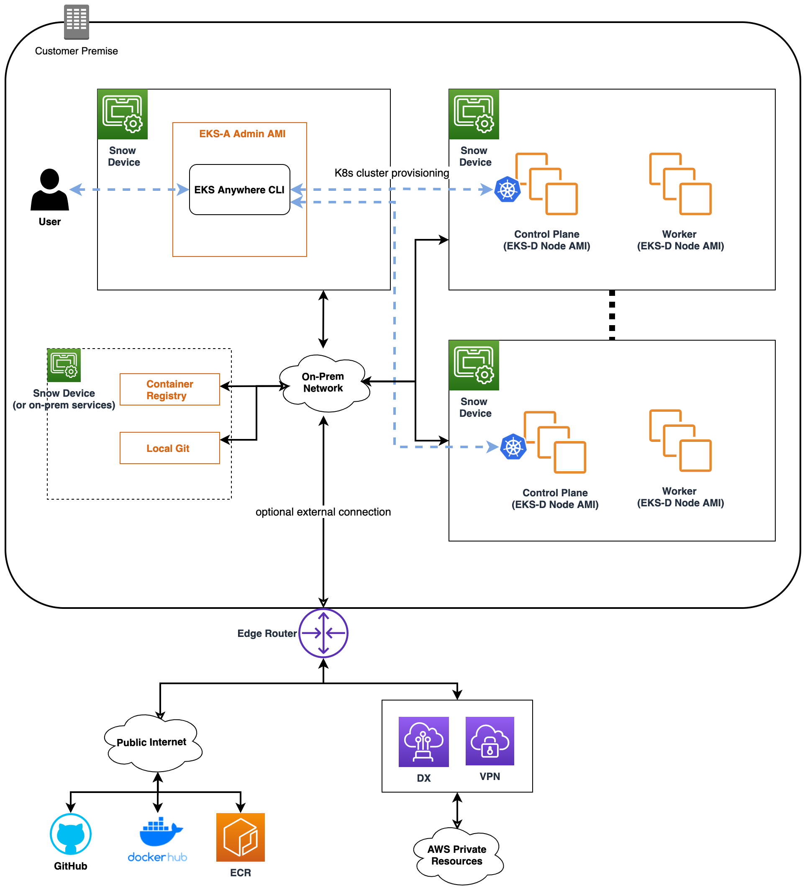

# Snow Provider Integration

## Overview

This document proposes a solution to integrate [Cluster API AWS Snow Provider](https://github.com/aws/cluster-api-provider-aws-snow) (CAPAS) into EKS Anywhere (EKS-A). The integration focuses on the EKS-A CLI and controller updates by introducing new EKS-A Snow CRDs, running preflight validations against Snow devices, setting up AWS credentials to bootstrap CAPAS components, applying and updating underlying CAPI/CAPAS template to provision Snow clusters.

## Scope

**In Scope**

* Extend EKS-A CLI `import-images` command to populate necessary images to existing local container registry
* Extend EKS-A CLI `generate clusterconfig` command to create Snow template
* Extend EKS-A CLI `create/upgrade/delete` command to support Snow provider
* Extend EKS-A Cluster Controller to create/upgrade/delete Snow workload cluster with `kubectl` / GitOps
* Build EKS-D (EKS Distro) Node AMI for Snow
* Build EKS-A Admin AMI for Snow

**Out Scope**

* Fetch Certificate bundle for Snow device
* Set up local container registry on Snow devices/instances
* Deploy EKS-A/EKS-D AMI and launch instances on Snow devices
* Create Snow jobs and launch EKS-A CLI (through Snow Console / AWS OpsHub)

## Solution

### Diagram



### API

We will add two CRDs to [`anywhere.eks.amazonaws.com`](http://anywhere.eks.amazonaws.com/) API

**SnowDatacenterConfig**

```go
type SnowDatacenterConfigSpec struct {}
```

**SnowMachineConfig**

```go
type SnowMachineConfigSpec struct {

    // The EKS-D Node AMI ID from which to create the machine instance.
    AMIID string `json:"amiID,omitempty"`
    
    // InstanceType is the type of instance to create. Example: m4.xlarge
    InstanceType string `json:"instanceType,omitempty"`
    
    // PhysicalNetworkConnector is the physical network connector type to use for creating direct network interfaces (DNI).
    // Valid values: "SFP_PLUS" (default) and "QSFP"
    PhysicalNetworkConnector string `json:"physicalNetworkConnector,omitempty"`
    
    // SSHKeyName is the name of the ssh key defined in the aws snow key pairs, to attach to the instance.
    SshKeyName string `json:"sshKeyName,omitempty"`

}
```

AMIID — optional. If not specified, choose an AMI in the devices matched with `cluster.version`.

### Preflight Validations

EKS-A runs a set of preflight validations on the provider environment to guarantee the cluster operation will always succeed if the validations pass, otherwise the operation fails ahead. For Snow environment specifically, we need to validate:

* the existence of EKS-D AMI if specified in `SnowMachineConfig`, across all devices
* control plane IP format and address not occupied
* all snowball devices are reachable (IP is reachable, port is listening)
* the devices have enough resource space to create the cluster
* SSH key exists and is valid

AWS provides [Snowball Edge Client](https://docs.aws.amazon.com/snowball/latest/developer-guide/using-client-commands.html), a CLI to get credentials and status information for the Snow devices. For example, `snowballEdge describe-device` checks on the device status and returns metadata for the physical network interfaces — this is an ideal tool for EKS-A to validate devices IPs, resource, etc. Currently, running the edge client [requires a different configuration process](https://docs.aws.amazon.com/snowball/latest/developer-guide/using-client-commands.html#client-configuration) than simply using the traditional AWS credentials. Configuring an edge client through EKS-A by passing around the Snow manifest file and unlock code raises security concerns; therefore, EKS-A will first rely on the AWS CLI / SDK to run validations — e.g. `aws ec2 describe images`, and switch to the Snowball Edge Client once Snow releases its client SDK or makes its CLI configurable through the traditional AWS credentials.

### User Experience

Snow device provision workflow deploys both EKS-A and EKS-D AMIs at data center

As of initial launch, a user creates a job in Snow console, which triggers the Snow device provision workflow that deploys both the EKS-A Admin AMI and EKS-D Node AMI to all the Snow devices in AWS data center. After receiving the devices, the user selects one device and runs EKS-A Admin AMI, then SSH’es into the instance as the admin machine to run EKS-A CLI. The user is expected to go through the standard EKS-A experience on this admin machine:

1. store the AWS credentials of all the devices with the device IP as profile name to a file (default: `~/.aws/config`)
2. get the Snow certificates of all the devices and store them to a file
3. export both credentials and CA bundle files location as environment variables
    1. `export EKSA_AWS_DEVICES_CREDENTIALS_FILE = ~/.aws/config`
    2. `export EKSA_AWS_DEVICES_CA_BUNDLES_FILE = ~/eksa/ca-bundles`
4. generate the cluster config file with the newly introduced provider arg: `eksctl anywhere generate clusterconfig $CLUSTER_NAME -p snow`
5. populate all the container images necessary to run EKS-A to the existing user managed local container registry: `eksctl anywhere import-images ...`
6. provision and manage Snow cluster with `eksctl anywhere create/upgrade/delete cluster ...` The EKS-D Node AMI defined in the `SnowMachineConfig` is chosen to launch the cluster node instance.
7. or optionally use `kubectl` / GitOps to manage workload cluster lifecycle

### Device Credentials

In CAPAS, the user needs to specify a list of environment variables:

* `AWS_B64ENCODED_CREDENTIALS` — Base64 encoded AWS credentials of all the devices (order agnostic)
* `AWS_B64ENCODED_CA_BUNDLES` — Base64 encoded Snow Certificates of all the devices (order agnostic)

and run `clusterctl init -p snow`  to set up Snow components in the bootstrap cluster. The credentials and certificates will be stored as `manager-bootstrap-credentials` secret in the management cluster to be used for EKS-A cluster controller.

**Credentials**

Snow requires the AWS credentials profile name be defined as the Snowball device IP to better support multi-device cluster setting. For example, 

```bash
[profile 10.111.60.128] # device_1 IP
aws_access_key_id = ABCDEFGHIJKLMNOPQR2T
aws_secret_access_key = AfSD7sYz/TBZtzkReBl6PuuISzJ2WtNkeePw+nNzJ
region = snow

[profile 10.111.60.130] # device_2 IP
aws_access_key_id = ABCDEFGHIJKLMNOPQR3T
aws_secret_access_key = Rq2AsrGU/RBCtzkReBl6PIneNX22WtNkeePw+WxzY
region = snow
```

For the initial launch, the user is expected to provide AWS credentials for all the devices following the above format and to export the credential file path as environment variable before running the EKS-A CLI. EKS-A then fetches the file and runs preflight validations against the device IPs with the credentials. Once validation succeeds, EKS-A encodes the credentials and passes them in to ENV `AWS_B64ENCODED_CREDENTIALS` when bootstrapping CAPAS components.

**Certificates**

For each Snow device, its certificate can be fetched through the Snowball Edge Client. Due to the limitation of using edge client on the admin machine, user is required to fetch all devices certificates and store them in a single CA bundle file within the admin machine, and export the file path as environment variable. EKS-A then validates the certificates, encodes it when bootstrapping CAPAS components. 

Example CA bundle file:

```bash
-----BEGIN CERTIFICATE-----
ZWtzYSBzbm93IHRlc3QgY2VydGlmaWNhdGUgZWtzYSBzbm93IHRlc3QgY2VydGlm
aWNhdGVla3NhIHNub3cgdGVzdCBjZXJ0aWZpY2F0ZWVrc2Egc25vdyB0ZXN0IGNl
cnRpZmljYXRlZWtzYSBzbm93IHRlc3QgY2VydGlmaWNhdGVla3NhIHNub3cgdGVz
dCBjZXJ0aWZpY2F0ZQMIIDXDCCAkSgAwIBAgIJAISM0nTVmbj+MA0GCSqGSIb3DQ
...
-----END CERTIFICATE-----

-----BEGIN CERTIFICATE-----
KJ0FPl2PAYPEjxr81/PoCXfZeARBzN9WLUH5yz1ta+sYUJouzhzWuLJYA1xqcCPY
mhVlkRsN4hVdlBNRnCCpRF766yjdJeibKVzXQxoXoZBjrOkuGwqRy3d3ndjK77h4
OR5Fv9mjGf7CjcaSjk/4iwmZvRSaQacb0YG5GVeb4mfUAuVtuFoMeYfnAgMBAAGj
azBpMAwGA1UdEwQFMAMBAf8wHQYDVR0OBBYEFL/bRcnBRuSM5+FcYFa8HfIBomdF
...
-----END CERTIFICATE-----
```

### Control Plane Load Balancing

EKS-A uses [kube-vip](https://kube-vip.chipzoller.dev/docs/) for control plane load balancing, where we create kube-vip as static pod in each control plane node instance. The kube-vip manifest template is built in as part of the EKS-D Node AMI for Snow integration specifically due to the EC2 instance user data limit of 16KB. The user specifies the control plane endpoint in the EKS-A `clusterSpec.controlPlaneConfiguration.endpoint` and EKS-A passes it down to the `kubeadmControlPlane` object as part of the pre/post KubeadmCommands. The control plane endpoint will be used as the vip_address along with the kube-vip container image when EKS-A runs the bootstrap script where it creates kube-vip pods.

```yaml
apiVersion: controlplane.cluster.x-k8s.io/v1beta1
kind: KubeadmControlPlane
metadata:
  name: capas-control-plane
spec:
  kubeadmConfigSpec:
    preKubeadmCommands:
      - /etc/eks/bootstrap.sh  {{.kubeVipImage}} {{.controlPlaneEndpoint}}
    postKubeadmCommands:
      - /etc/eks/bootstrap-after.sh {{.kubeVipImage}} {{.controlPlaneEndpoint}}
...
```

### SSH Keys

There are two ways to add SSH keys to the node instance through Cluster API (CAPI):

1. In CAPI, the user specifies `users[n].sshAuthorizedKeys` (public key) in `KubeadmControlPlane` and `KubeadmConfigTemplate` to configure multiple users with SSH keys to access the control plane / worker node instances.
2. In CAPAS, the user can pass the SSH key name defined in the AWS Snow key pairs to `SnowMachineSpec` to attach a single key to the instance.

EKS-A plans to first support the CAPAS way of attaching SSH keys (method 2) to the instance since it follows the standard AWS pattern as well as the Cluster API AWS Provider (CAPA) pattern. It also mitigates the security concern since the key pair is created and guarded by AWS instead of fully managed by the user.

## Future Work

**Auto-populate EKS-D Node AMI**
  
If an `AMIID` is not specified in the `SnowMachineConfig`, EKS-A will check if a valid AMI exists on the devices based on its tags and will select one as default to bootstrap cluster nodes; this is similar to how EKS-A auto-picks or auto-creates an OVA template in vSphere. If no valid AMI exists, EKS-A will load an AMI to the devices on-the-fly with a proper AWS/Snow client (Discuss the possibility with Snow team to auto-populate AMI if it does not exist).

**Auto-generate SSH key pairs**

For beta, the user is required to create the key pairs in the Snow console before specifying the key name in the EKS-A Spec. In a future release we could potentially automate the SSH key generation process for users by utilizing AWS CLI / SDK, and storing the private key in the admin machine. So the user no longer needs to create a SSH key on Snowball EC2 ahead of time.

**Utilize Snowball Edge Client**

EKS-A aims to automate as many of the configuration steps as possible before provisioning the cluster. Once the Snowball Edge Client is accessible within EKS-A, or if EKS-A can be launched through OpsHub, we can automate the entire certificate generation and setup processes. Ideally the user will only need to provide a list of AWS device credentials, EKS-A will then generate the certificates for each device by calling the edge client and encoding both credentials as well as certificates to pass to CAPAS components for bootstrapping. The edge client can also be used to run preflight validations on the device status.

**Select a subset of devices for cluster provisioning**

CAPAS allows the user to select a subset of devices defined in the AWS credentials / certificates bundles, and pass them in to the `DEVICE_IPS` ENV var (as a comma-separated list of Snow device IP’s) to create a Snow cluster using only the devices with IPs listed there. Once this behavior is supported in CAPAS, EKS-A will add the `DeviceIPs` as a configurable field in the `SnowDatacenterConfigSpec`.
