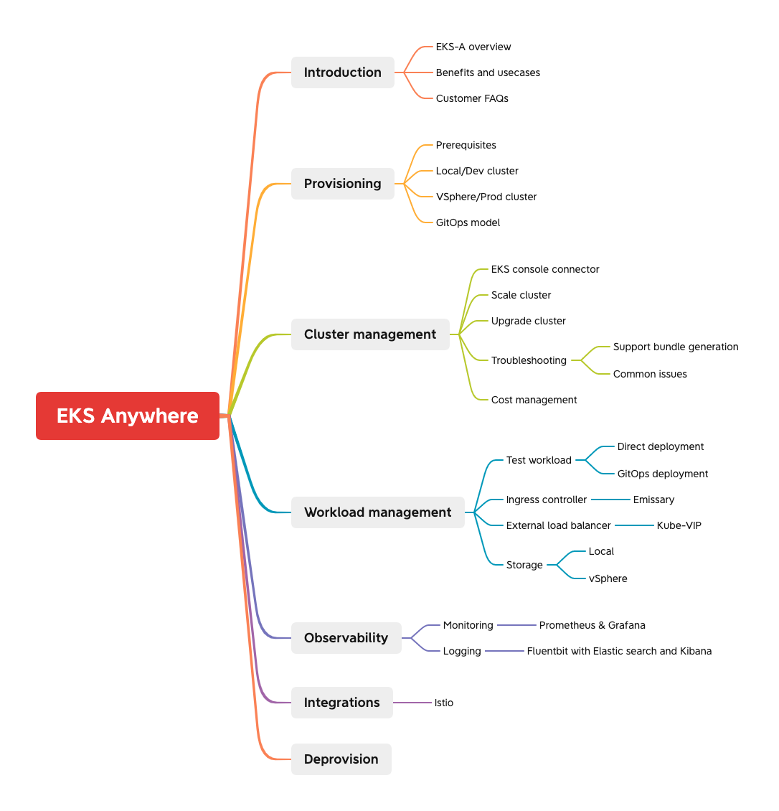

The intent of this workshop is to educate users about the EKS-Anywhere and their different use-cases. As part of this workshop we also covering how to provision and manage EKS-Anywhere cluster, run workloads and leverage observability tools like Prometheus and Grafana to monitor the EKS-Anywhere cluster. We recommend this workshop for Cloud Architects, SREs, DevOps engineers, and other IT Professionals.

Here is the high level view of all the epics covered part of this workshop

