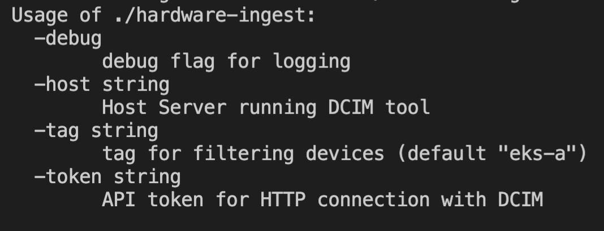

## Hardware-ingester

An automated hardware ingestion tool for cluster creation on bare metal in [eks-a](https://anywhere.eks.amazonaws.com/docs/getting-started/production-environment/baremetal-getstarted/).
Kubernetes cluster creation workflow on bare metal in eks-a requires a "hardware.csv" as input - a csv file containing the hardware data. At present, this step is manually
done in the cluster creation process. This tool provides an alternate automated approach of "hardware.csv" file generating by directly pulling the Hardware Inventory Data from DCIM.
Currently, the supported DCIM tool is Netbox.

## USAGE

CLI:

## Context

For more information on Netbox refer the official documentation [page](https://docs.netbox.dev/en/stable/)
